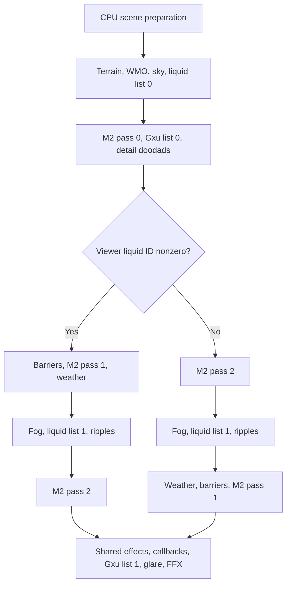

# 3.3.5.12340 rendering accuracy plan: DX9 Shader Model 3.0

Last updated: 2026-10-02. Reference: 32-bit `Wow.exe` 3.3.5 build 12340,
Direct3D 9 with `vs_3_0` / `ps_3_0` capabilities. Destination:
`WTEditor.Avalonia`, `WoWRenderLib.DX11`, and their dependencies.

This extends [CLIENT_335_LIGHTING_PORT_PLAN.md](CLIENT_335_LIGHTING_PORT_PLAN.md)
to the complete rendering pipeline. Keep that document's lighting findings and
open items as part of R03 below. [RENDERING_FEATURE_STATUS.md](RENDERING_FEATURE_STATUS.md)
remains the implementation ledger. This document defines the work and evidence
needed to claim accuracy; it does not mark the renderer accurate today.

The goal is to recover every rendering rule reachable in the reference client's
SM3 configuration, including CPU preparation, shader selection, bytecode
formulas, fixed-function state, visibility, animation, draw order, shadows,
liquids, effects, and presentation. Translate that behavior to DX11 with an
explicit 3.3.5 profile. A later-client implementation or a readable third-party
shader is a lead until it matches the 12340 evidence.

## Start here in a new thread

Continue implementation of 3.3.5.12340 client rendering parity in the active
Avalonia/DX11 projects. Read these opening sections and the relevant CPU audit
section; the inventories and chronological notes below are reference material,
not a startup reading checklist. Check the current checkout and preserve existing
changes. Do not recreate the shader cache or re-export the IDB to begin work.

- **Current focus / baseline:** replace the approximate liquid implementation.
  Basic 12340 water/specular-water/magma now reach terrain and WMO draws with
  native slots, clocks, generated 8x64 gradients, depth ramps, UV rules and
  retained indoor alpha. Specular uses packed sun band 9; the fixed indoor light
  contributes zero specular. Native material-flag lists now flush separately,
  list 0 before opaque M2, with placement/generation-owned identities and duplicate
  suppression. Retained CPU grids feed a live viewer type/depth query, preserving
  original WMO query types independently of indoor draw remaps. Retained entity
  queries now feed live mesh above/below partitions and signed GPU clipping around
  list 1. Scene +0x140 retains the update-time ID separately from the refreshed
  render viewer ID. Full smoke exits 0 with **1,052 tests** (66 Render, 793 DX11,
  193 Avalonia); the latest batch adds 14 cases, including two WARP fixtures.
  Complete liquid parity remains open. **Next:** neighboring WMO spatial links
  and native availability histories, shared mesh/ribbon/particle water queues;
  then procedural material 3, waves, ripples and underwater fog/particulate. MCLQ,
  portal-dependent WMO color, local-light variants and matched captures remain
  required. See the [entity/mesh batch](reference/client-335/CPU_SCENE_AUDIT.md#entity-liquid-cache-scene-history-and-mesh-water-clipping-2026-10-02)
  and [queue/query batch](reference/client-335/CPU_SCENE_AUDIT.md#liquid-lists-retained-identities-and-viewer-grid-query-2026-10-02)
  and [basic shader batch](reference/client-335/CPU_SCENE_AUDIT.md#basic-liquid-shaders-gradients-and-native-inputs-2026-10-02).
- **Prior M2 baseline:** that batch passed 992 smoke tests (66 Render,
  733 DX11, 193 Avalonia). WotLK MPQ mesh batches retain authored sort flags,
  signed priority/layer and section center-bone/center/radius/bone-combo/influence inputs.
  Section +0x0E was previously mislabeled/decoded as bone count; it is now
  corrected to bone-combo start. Authored water bounds/radius remain separate
  from expanded culling bounds. Native simple-animation eligibility enables
  a guarded root-only no-pose path. Mesh shader selectors resolve actual supplied
  effect-table identities, and composed-alpha mesh preparation feeds retained queues;
  post-query entity lighting and initial particle force-below mapping are ported,
  with 35 new preparation cases. Scene-wide effect/resource and liquid-query/cache
  producers remain open.
  The live pose cache now retains the full CPU skeleton separately from its
  256-entry mesh upload palette. Full placement/view transforms feed billboard
  and root-relative parent evaluation, with native normalization/inheritance gates.
  A retained mesh adapter reads these poses and lifetime-owned model/shared/batch
  tokens; BLP tokens follow resolved SRV lifetimes. Tokens preserve sharing and
  generations, not reference-process allocator order. There are 21 new pose/identity
  cases alongside 25 native-profile/transform cases. CPU-only M2 model/mesh distance keys, the complete
  base transparent/opaque comparators and native heap mechanics are ported,
  with 31 ordering cases. Particle/ribbon keys, the gated additive regrouping
  heap and per-type water sphere/plane routing now feed retained CPU queues,
  with 37 new cases including production packet/pose keys across frames.
  Live producers, GPU interleaving and water clipping remain open; these
  policy/input batches do not change GPU order.
  M2 mesh submission now owns its constants, palette,
  instance uploads and depth states in `M2MeshRenderer`; SceneManager retains
  preparation and frame ordering. WARP fixtures cover both phases, 1,025-instance
  chunking, pose updates and state/upload cleanup on failures.
  Exterior doodads now enlist sphere-derived depth
  buckets and consume cropped frusta, static volumes and the terrain-sphere
  reader before each band's horizon updates. Terrain rejection consumes pending
  eligibility; frustum/volume failure retains it. Portal-written fog banks persist
  across exterior frames. Loaded WMO doodads use transformed-box size categories,
  detail-scaled bucket/portal thresholds and CPU hard-distance/alpha eligibility;
  fresh definitions start with staged fog. Retained opacity now reaches GPU
  draws, composed alpha selects the translucent blend and scaled cutout reference,
  and fading instances leave the opaque group. Default non-shadow fade pixels
  and authored depth/state restoration pass. Layered meshes use their base
  material's queue class, with blend/cutout/depth state retained per layer.
  ZFill controls/eligibility/clone state are recovered; native sorted queues
  and eligibility reseeding still block its port. Shadow variants remain open.
  The Client-only Stormwind gray layer was traced to
  transition alpha surviving into Avalonia's imported BGRA image; Editor glow
  masked it by writing opaque alpha. External presentation now writes alpha 1
  after all scene passes, preserving every RGB channel and native material alpha.
  GPU regressions and the captured scene verify this correction; acceptance in
  the user's rebuilt viewport and matched reference pixels remain open.
  Static WMO doodads now use MODR ownership and
  MOGI-derived baked MODD lighting indoors, with per-instance DX11 inputs and
  native material lit gates. Portal callbacks retain six-plane sphere frusta;
  unbucketed/final group consumers choose staged/current fog on first admission
  and carry it per M2 instance. Exterior WMO gates consume the 384-column
  terrain clip buffer with depth-band edge updates, MCNK hole erasure and
  updated-placement bypasses, alongside static CPU occluder volumes.
  World-horizon line sources, native terrain/streaming bounds, GPU volumes,
  numerical captures and matched client pixels remain open.
  The original bounded portal/occlusion list has five
  incomplete function contracts; it is not a full rendering-closure count.
- **First acceptance slice (reported WMO gray layer):** rebuild/reopen the
  affected viewport and compare Client/Editor modes with glow enabled/disabled
  at placement 10047 and the captured noon camera. The headless scene retains
  identical RGB in all 451,200 pixels while making its final alpha opaque.
  Verify the UI wash is gone, then compare native lighting/fog pixels.
  `0x7A9380` and `0x7A8B10` remain partial ports: local-light permutations,
  shadow receivers, other material families and fallback paths remain open.
  See the [presentation audit](reference/client-335/CPU_SCENE_AUDIT.md#wmo-transition-alpha-and-opaque-gui-presentation-2026-10-01).
- **Next doodad slice:** connect live producers to retained native CPU queues;
  supply live owned effect tables/resolved texture keys and effect admission/
  child lifetimes, then neighboring WMO spatial links and native availability/
  invalidation histories. Terrain/MODR entity queries, retries, scene +0x140 history
  and mesh water partitions/clipping are connected. Guarded simple poses, mesh shader
  selectors/table adaptation, authored bounds and initial particle water mapping
  are ported. Particle/ribbon keys, `0x81F9E0` additive regrouping and per-type
  water routing are ported. Implement shared GPU mesh/ribbon/particle interleaving
  before wiring ZFill's color-mask
  clones into the extracted M2 renderer. Separate
  `M2UseZFill` (default on) from `objectFadeZFill` (default off, clears eligibility
  for size categories 0–2 during preparation); trace model bit 0x40 reseeding and
  loaded-definition lifetimes, then shadow alpha selectors. Base-material layer
  partition is ported. `CM2+0x178` now
  reaches default non-shadow WMO doodad GPU fades; size-category writers
  (`def+0x24`), initial staged fog, `0x78FB60` thresholds and `0x791CB0` CPU gates
  are ported. Global sorted element/water queues remain a separate submission gap.
  The `0x7998A0`/`0x7987A0` spatial consumers and `0x78FC40` terrain-sphere
  reader are partially ported; see the
  [layer/ZFill batch](reference/client-335/CPU_SCENE_AUDIT.md#doodad-layered-material-partition-and-zfill-dependency-2026-10-01)
  and [M2 renderer batch](reference/client-335/CPU_SCENE_AUDIT.md#m2-mesh-submission-renderer-2026-10-01).
  The [ordering policy batch](reference/client-335/CPU_SCENE_AUDIT.md#m2-element-keys-comparator-and-heap-policy-2026-10-01)
  records the full base comparator and exact adapter inputs.
  The [decoded-input batch](reference/client-335/CPU_SCENE_AUDIT.md#m2-decoded-sort-metadata-and-transform-inputs-2026-10-01)
  retains those authored values without a listfile or asset-ID sort proxy.
  The [retained-pose batch](reference/client-335/CPU_SCENE_AUDIT.md#m2-full-pose-billboard-and-retained-sort-identities-2026-10-01)
  establishes direct full-bone indexing and corrects live billboard/parent inputs;
  CM2 attachment/runtime override lifetimes and allocator-dependent ties remain open.
  The [queue batch](reference/client-335/CPU_SCENE_AUDIT.md#m2-particle-keys-additive-regrouping-and-water-queues-2026-10-01)
  records particle callers, scene-wide additive count gates and water-routing contracts.
  The [preparation batch](reference/client-335/CPU_SCENE_AUDIT.md#m2-native-mesh-preparation-and-shader-selectors-2026-10-01)
  records simple initialization, resolved shader-table selection and the corrected
  section bone-combo field; GPU consumption remains open.
  Acceptance: preserve the 25 decoding/transform and 31 ordering cases;
  preserve the 21 full-bone/billboard/parent/identity cases; complete attachment/runtime
  histories; preserve the 35 preparation and 37 additive/water queue cases and add live producer,
  interleaved GPU/water clip pixels and state restoration fixtures;
  sorted clone/color ordering, independent ZFill control/category
  and toggle/reload histories, shadow/layered cutout fixtures,
  indoor/exterior and unload/reload histories. Preserve mixed opaque/cutout/alpha
  fade pixels/state restoration and category/distance/alpha
  boundaries, CVar gates, fresh staged fog,
  verified sphere bucket floors/cutoffs, retry versus consumption and prior
  portal fog history; compare matched client captures.
- **Remaining exterior occlusion slice:** finish the exterior queue consumers' native
  horizon feed. Trace writers of the sort-table line list at bucket offset 0x3C
  (bucket-zero base `0xCD9084`) and endpoints passed at `0x7938BC` to
  `0x7CC880`/`0x78F900`; connect protected lines after terrain-hole erasure.
  Terrain edge producers and box reader `0x78FDC0` now feed the bucket/adapter
  WMO gates; flags=1 retains the stored clip-Z >=50 requirement, while
  unbucketed a4=1 bypasses terrain rejection. `0xD2DCEC` is a volume count, not a
  clip-enable flag: its static producers and `0x7CCE00`/`0x7CCFA0` predicates
  are now ported. Scene-wide CPU preparation
  now precedes GPU asset batching and collects all accepted exterior polygons;
  primary interior windows remain separate and secondary visible callbacks survive
  their window reset. Source bounds use the eight-corner base-frustum AABB;
  decoded editor availability still adapts native runtime 0x80/loaded-group bit 1,
  whose streaming lifetimes and runtime 0x20 writers remain open. Begin with the
  [terrain clip-buffer batch](reference/client-335/CPU_SCENE_AUDIT.md#terrain-clip-buffer-and-depth-band-feed-2026-09-30), the
  [static CPU occluder batch and scoped function list](reference/client-335/CPU_SCENE_AUDIT.md#static-cpu-occluder-volumes-and-portal-early-out-2026-09-30), the
  [scene-wide queue batch](reference/client-335/CPU_SCENE_AUDIT.md#scene-wide-exterior-queues-and-placement-cache-2026-09-30), the
  [exterior group-order batch](reference/client-335/CPU_SCENE_AUDIT.md#exterior-group-depth-order-2026-09-30), the
  [interior window/complement batch](reference/client-335/CPU_SCENE_AUDIT.md#interior-portal-windows-and-complements-2026-09-30), the
  [exterior queue batch](reference/client-335/CPU_SCENE_AUDIT.md#exterior-portal-render-view-queues-2026-09-30), the
  [Stormwind contract table](reference/client-335/CPU_SCENE_AUDIT.md#stormwind-directed-portals-and-camera-boundaries-2026-09-30)
  and [scene-view findings](reference/client-335/CPU_SCENE_AUDIT.md#scene-portal-views-and-sky-scissor-2026-09-30).
  The callback's two stack arguments and both pointer installations are now
  instruction-supported, and `0x7A70B3` sets the emission gate to 1. Its full
  group/liquid/frustum consumers remain incomplete.
- **Code entry points:** [WmoPortalVisibility](../WoWRenderLib.DX11/Renderer/WmoPortalVisibility.cs),
  [M2MeshRenderer](../WoWRenderLib.DX11/Renderer/M2MeshRenderer.cs),
  [Wrath335M2ElementOrdering](../WoWRenderLib.DX11/Renderer/Wrath335M2ElementOrdering.cs),
  [WmoScenePortalPreparation](../WoWRenderLib.DX11/Renderer/WmoScenePortalPreparation.cs),
  [Wrath335PortalRenderViews](../WoWRenderLib.DX11/Renderer/Wrath335PortalRenderViews.cs),
  [Wrath335ExteriorGroupOrder](../WoWRenderLib.DX11/Renderer/Wrath335ExteriorGroupOrder.cs),
  [Wrath335SceneExteriorGroups](../WoWRenderLib.DX11/Renderer/Wrath335SceneExteriorGroups.cs),
  [Wrath335ClipVolumes](../WoWRenderLib.DX11/Renderer/Wrath335ClipVolumes.cs),
  [Wrath335TerrainClipBuffer](../WoWRenderLib.DX11/Renderer/Wrath335TerrainClipBuffer.cs),
  [Wrath335SceneTerrainOcclusion](../WoWRenderLib.DX11/Renderer/Wrath335SceneTerrainOcclusion.cs),
  [Wrath335ExteriorDoodads](../WoWRenderLib.DX11/Renderer/Wrath335ExteriorDoodads.cs),
  [Wrath335WmoDoodadVisibility](../WoWRenderLib.DX11/Renderer/Wrath335WmoDoodadVisibility.cs),
  [Wrath335PortalComplement](../WoWRenderLib.DX11/Renderer/Wrath335PortalComplement.cs),
  and [Wrath335PortalSceneViews](../WoWRenderLib.DX11/Renderer/Wrath335PortalSceneViews.cs).
  Extend [portal traversal tests](../WoWRenderLib.DX11.Tests/Wrath335PortalTraversalTests.cs),
  [exterior queue tests](../WoWRenderLib.DX11.Tests/Wrath335ExteriorPortalViewsTests.cs),
  [exterior group-order tests](../WoWRenderLib.DX11.Tests/Wrath335ExteriorGroupOrderTests.cs),
  [scene queue tests](../WoWRenderLib.DX11.Tests/Wrath335SceneExteriorGroupsTests.cs),
  [scene preparation tests](../WoWRenderLib.DX11.Tests/WmoSceneViewerQueryTests.cs),
  [CPU occluder tests](../WoWRenderLib.DX11.Tests/Wrath335ClipVolumesTests.cs),
  [terrain clip-buffer tests](../WoWRenderLib.DX11.Tests/Wrath335TerrainClipBufferTests.cs),
  [exterior doodad tests](../WoWRenderLib.DX11.Tests/Wrath335ExteriorDoodadsTests.cs),
  [terrain sphere tests](../WoWRenderLib.DX11.Tests/Wrath335TerrainSphereOcclusionTests.cs),
  and [Stormwind tests](../WoWRenderLib.DX11.Tests/Stormwind335PortalTests.cs) as needed.
- **Slice acceptance:** independent world-horizon endpoint/enlistment fixtures,
  protected-line versus hole ordering and accepted/rejected WMO cases. Retain the verified global
  group/polygon order, interleaved placement cache behavior and the separation of
  interior window/complement rectangles from exterior polygons.
  Run the full smoke suite after the code batch. Final facade/sky/depth pixel
  comparisons remain a separate capture gate; list tests do not complete occlusion.
- **Then:** wire GPU volume state/frame order and propagate global exterior
  rectangles/distances to the remaining consumers. The [Roadmap](#roadmap)
  retains all CPU and SM3 work.

## Working loop

The unit of progress is an implemented rendering behavior with meaningful
verification. Exports, inventory counts and repeated cache checks are supporting
work, not completed rendering work. This revision removes routine overhead
without lowering the parity gates; no token-per-task improvement has been measured.

1. Pick one concrete gap from the roadmap and inspect its renderer/test consumer.
2. Answer only the evidence questions that block that change. Use focused live
   IDA MCP for new addresses, callers, field writers and instruction questions;
   reuse small cached slices when they already answer the question. A local file
   is not inherently cheaper or more accurate. Existing IDB labels/types remain
   unverified. Follow a dependency now when its contract affects this behavior;
   defer unrelated graph closure to its own workstream.
3. Implement the recovered rule and independent behavioral coverage, scoped to
   12340 where appropriate. Aim to finish a coherent code/test batch in a
   continuation. An analysis-only batch is justified when a specific unknown
   prevents a sound port; record that unknown, what was established and the exact
   next trace instead of expanding the export inventory.
4. Run focused checks during development and the full repository smoke suite once
   the code batch is complete. Do not repeat tests for unchanged state. Perform
   the matched capture when available; otherwise leave its gate explicitly open.
5. Write one compact entry in the CPU audit: rule and build/address/sites,
   implementation, verification, uncertainty and next action/acceptance. Keep the
   roadmap current; update lighting/status documents only where status changes.
   Link that entry rather than copying it into every ledger.

Do not load whole manifests, sweep all cached links, regenerate function counts,
rewrite the 27,280-row inventory or duplicate the call graph each prompt. Complete
CPU exports are optional: save them for a concrete reproducibility need or when a
whole-body investigation needs them. Save tool output once without replaying it
into the conversation; retain only the relevant instruction sites and conclusions
in working notes. Existing bulk evidence remains available on demand.

Reconcile the exhaustive CSV/JSON inventories, semantic claims and indirect-call
frontier at workstream milestones, relevant reference changes or final sign-off.
Record snapshot dates and pending deltas in the active notes until reconciliation;
archival counts are not current semantic coverage. The original binary hash,
complete rendering reachability and numerical/pixel validation remain final gates.
They are not prerequisites to every independently supported implementation slice.
Retain the extract-once BLS workflow: it avoids actual repeated decoding and
disassembly, independently of the optional CPU export archive.

## Roadmap

Liquid implementation is the active priority following the user's report that
the existing pass is inaccurate. Basic 12340 material 1/2 shaders and their
texture/gradient inputs, material-flag lists, retained placement identities and
decoded-grid viewer queries are connected. Entity terrain/MODR caches, scene-side
history and mesh water interleaving/clipping are connected for the default clip
setting. Neighboring WMO links, native availability/invalidation histories, shared
effect ordering and material 3 remain open. The current full smoke baseline is
**1,052**. The
[entity/mesh audit](reference/client-335/CPU_SCENE_AUDIT.md#entity-liquid-cache-scene-history-and-mesh-water-clipping-2026-10-02)
records formulas, addresses, verification and ordered acceptance checks.

Focused IDB annotation batch: the fog-rate helper at `0x7ECD00` now has
verified distance argument names, descriptive temporaries and typed supporting
globals; fresh decompilation of its three callers passed and the IDB was saved.
See the [compact CPU review](reference/client-335/CPU_SCENE_AUDIT.md#daynight-fog-rate-idb-annotations-2026-10-01)
for original-return-width uncertainty and ordered numerical follow-up checks.
This adds no rendering implementation or parity closure.

Completed portal batch: Stormwind facade/single-owner portal contracts and
camera-on-portal boundaries. The partial port retains directed MOGP-owned links,
accepts null references without invalidating the graph, preserves source plane
coefficients, uses the native polygon-edge rule and world clipping tolerance,
omits the **near** plane, and follows the native previous-group/depth policy.
The selected placement's exterior seeds consume its emitted window. Full smoke:
**494 tests**, including 24 new portal cases; matched client pixels remain pending.

Viewport controls batch: Client mode and Ultra are the defaults; mode selection
is available only in the viewport's Advanced Rendering controls. Client CVars
remain editable in Settings in either mode. Editor fog now defaults off.
Client mode excludes viewport filters, diagnostic overlays, custom distance/LOD
and streaming overrides, animation/particle percentage limits, fog suppression,
manual lighting/time and the separate editor glow override. Game CVars remain
authoritative; both saved banks survive mode switches. UI overrides are disabled
in Client mode. Verified: conflicting-bank tests, default fog, independent glow,
manual-lighting isolation and mode restoration pass; full smoke exits 0 with
**524 tests** (66 Render, 267 DX11, 191 Avalonia). Matched pixels remain
required for rendering parity.

Exterior queue batch: depth-zero back-facing blockers, eligible offset-polygon
emission, cache bits 4/8 and ordered disjoint forwarding are now implemented
for 12340. The primary scene preparation retains its render views separately
from sky/exterior unions; other placements retain forwarded scratch lists.
Twenty new behavioral cases include real Stormwind facade direction crossings.
Full smoke exits 0 with **544 tests** (66 Render, 287 DX11, 191 Avalonia).
See the [compact CPU entry](reference/client-335/CPU_SCENE_AUDIT.md#exterior-portal-render-view-queues-2026-09-30)
for evidence, remaining gaps and acceptance. No complement or GPU occlusion
consumer was completed by that list port.

Interior window/complement batch: scene preparation now retains emitted interior
windows separately from exterior polygons and sky/exterior unions, then builds
the native ordered rectangle subtraction at `0x7968D0`. The port preserves
zero-area projected windows, touching-edge rules, the strict greater-than-60
fragment guard (including dropped unprocessed pieces), zero output distance,
and primary/secondary/reset gates. Full smoke exits 0 with **565 tests**
(66 Render, 308 DX11, 191 Avalonia), including 21 new cases. See the
[compact CPU entry](reference/client-335/CPU_SCENE_AUDIT.md#interior-portal-windows-and-complements-2026-09-30).
GPU volume submission and matched pixels remain open.

Exterior group-order batch: depth-sorted exterior seeds now visit buckets 0–63
within each placement, preserving source group order within a bucket. The port
uses transformed MOGI bounds, the nearest camera-facing corner, horizontal depth,
staged float scale and nearest-even conversion; updated-transform placements
retain their existing source order. A behavioral fixture proves that a nearer
seed can retain a shared portal polygon before a farther blocker stamps emission
bit 8. Full smoke exits 0 with **585 tests** (66 Render, 328 DX11, 191 Avalonia),
including 20 new cases. See the
[compact CPU entry](reference/client-335/CPU_SCENE_AUDIT.md#exterior-group-depth-order-2026-09-30).
Scene-wide queues and no-viewer rebucketing were completed in the following batch;
native occlusion remains open.

Scene-wide exterior batch: CPU preparation now follows placement/group arrival
order across all 12340 placements, independently of GPU asset buckets. It gates
sources by the base-frustum AABB, rebuckets updated groups outdoors with the native
first-cutoff break, and reads live visible-group bounds for enclosed unbucketed
visits. Shared interior/exterior cache generations preserve consecutive-placement
deduplication and A/B/A re-emission; always-draw callbacks do not switch the cache.
Secondary visible callbacks survive the primary window reset, and accepted exterior
polygons append to one scene list. Full smoke exits 0 with **613 tests**
(66 Render, 356 DX11, 191 Avalonia), including 28 new cases. See the
[compact CPU entry](reference/client-335/CPU_SCENE_AUDIT.md#scene-wide-exterior-queues-and-placement-cache-2026-09-30).
Native streaming activation, point-cull/clip buffers, GPU volume submission and
matched pixels remain open.

Static CPU occluder batch: the 62 build-12340 map-specific polygons now produce
reusable plane/volume ranges after interior preparation. Depth clipping preserves
source flags, full camera pitch, coplanar tolerance and original cap facets.
Exterior buckets reject fully enclosed MOGI spheres; updated unbucketed visits
bypass this sphere gate. Portal projection tests offset world points before
frustum clipping, with cache bit 0x10 derived from destination MOGI and owner
MOGP bit 8. Full smoke exits 0 with **639 tests** (66 Render, 382 DX11,
191 Avalonia), including 26 new cases. See the
[compact CPU entry and scoped function list](reference/client-335/CPU_SCENE_AUDIT.md#static-cpu-occluder-volumes-and-portal-early-out-2026-09-30).
That batch ported six of the thirteen identified CPU/consumer contracts for the
world-scene path and left seven incomplete, including partially ported consumers
and projection numerical validation. This is a bounded list, not dependency
closure. Terrain clip buffers followed in the next batch; GPU volumes and
matched captures remain open.

Terrain clip-buffer batch: the 384-column CPU horizon now receives loaded terrain
edge updates at the end of each depth band, after that band's WMO tests. Intact
chunks defer updates to their far-corner band and honor the exterior +33.333332 /
farclip -33.333332 distance window; chunks with holes erase unprotected columns.
WMO box rejection retains the clip-Z gate, nearest-even column conversion and
extra right column; updated unbucketed visits bypass it. Full smoke exits 0 with
**674 tests** (66 Render, 417 DX11, 191 Avalonia), including 35 new cases. See
[the compact CPU entry](reference/client-335/CPU_SCENE_AUDIT.md#terrain-clip-buffer-and-depth-band-feed-2026-09-30).
The original thirteen-contract list now has five incomplete contracts; separate
world-horizon sources and terrain streaming/combined-bounds adaptation remain
outside that bounded list. Full terrain culling and final-frame parity remain open.

Static WMO doodad lighting batch: MODR ownership now gates 12340 spawning;
missing MODS ownership is retained as invalid. MOGI interior/exterior references
select baked MODD lighting or sunlight; any exterior reference remains authoritative
for a shared doodad. Per-instance light inputs keep mixed copies in one M2 draw,
and unlit/modulate materials retain the native lit gate. Full smoke exits 0 with
**698 tests** (66 Render, 441 DX11, 191 Avalonia), including 24 new cases and
a WARP pixel fixture using the live M2 shader/input layout. See the
[compact CPU entry](reference/client-335/CPU_SCENE_AUDIT.md#static-wmo-doodad-ownership-and-baked-lighting-2026-10-01).
At that batch, portal sphere/frustum culling and per-doodad fog remained open;
the following batch advances those consumers. Underwater/dynamic lights, entity
MOCV queries and matched client captures remain open.

Doodad portal/fog batch: every scene callback retains a six-plane world frustum.
Unbucketed consumers snapshot the frustum chain and propagated flag at their
call site; final group consumers follow first-callback append order. The first
accepting owner selects staged/current fog per M2 instance. Full smoke exits 0
with **718 tests** (66 Render, 459 DX11, 193 Avalonia); 18 new CPU cases and
extended live-shader WARP fog pixels pass. See the
[compact CPU entry](reference/client-335/CPU_SCENE_AUDIT.md#doodad-portal-sphere-admission-and-instance-fog-2026-10-01).
At that batch, the exterior adapter retained scene fog; native enlistment,
terrain-sphere occlusion, fog history, size/fade gates and captures were open.
The exterior spatial batch below advances those consumers.

WMO transition batch: native root bypasses, final transition endpoint,
near-plane projection and major-axis polygon rules are audited. The 12340 port
corrects attenuation/portal distance, c28=127/255, non-unified/no-MOCV pass
dispatch, forced-staged unified opaque exterior fog and strict-interior
eligibility/portal weighting across both retained viewer groups. Full smoke exits 0
with **744 tests** (66 Render, 485 DX11, 193 Avalonia), including 22 new CPU/WARP
cases. See the [compact CPU entry](reference/client-335/CPU_SCENE_AUDIT.md#wmo-transition-colors-lighting-and-fog-2026-10-01).
The subsequent live inspection identifies the gray layer as presentation alpha:
native transition states leave their lighting weight in target alpha, which
the GUI treats as viewport transparency when glow is disabled. The final
external-image pass writes alpha 1 without changing RGB. Full smoke exits 0
with **746 tests** (66 Render, 487 DX11, 193 Avalonia). The captured full scene
has zero changed RGB pixels and zero nonopaque pixels after this pass; rebuilt
UI acceptance and full native lighting parity remain open. See the
[presentation audit](reference/client-335/CPU_SCENE_AUDIT.md#wmo-transition-alpha-and-opaque-gui-presentation-2026-10-01).

Exterior doodad spatial batch: the scene-wide queue replaces the exterior
adapter with sphere-depth buckets, originating-group floors, nearest-even cutoffs,
one active shared-definition link and per-band spatial admission. The terrain
sphere reader retains its separate projected radius, center-depth/epsilon/pitch
gates and extra right column. Frustum/volume failures retain portal eligibility;
terrain rejection consumes it. Bucket draws retain the last portal-written fog
bank across frames. Full smoke exits 0 with **778 tests** (66 Render, 519 DX11,
193 Avalonia), including 32 new behavioral cases and the loaded-M2 preparation
seam. See the [compact CPU entry](reference/client-335/CPU_SCENE_AUDIT.md#exterior-doodad-depth-buckets-and-terrain-sphere-admission-2026-10-01).
At that batch, initial fog-bit writers and size/fade gates remained open; the
following batch advances them. Definition availability and animation/barrier
branches still leave both bucket functions partial.

Doodad size/fade batch: loaded WMO definitions use inclusive transformed-box
categories, detail-scaled thresholds, bucket and first-callback group prefilters,
then center-distance and alpha submission gates. Fresh MODD definitions start
with staged fog; a submission rejection preserves portal-written history.
At that batch CPU opacity was retained without GPU fade blend/state; the
following batch connects the default non-shadow path.
Full smoke exits 0 with **812 tests** (66 Render, 553 DX11, 193 Avalonia),
including 34 new cases. See the
[compact CPU entry](reference/client-335/CPU_SCENE_AUDIT.md#doodad-size-categories-cpu-fade-gates-and-initial-fog-2026-10-01).

Doodad GPU fade batch: per-instance opacity composes with animated material alpha,
opaque/cutout materials move to the translucent blend below the native threshold,
and scaled byte cutout references test composed output alpha. Full-opacity
instances remain grouped; distance/material-alpha fades submit separately with
their pose retained. Authored depth flags remain active and restore for the next
draw. Full smoke exits 0 with **827 tests** (66 Render, 568 DX11, 193 Avalonia),
including 15 new cases and extended live-shader WARP fade/cutout/depth pixels.
See the [compact CPU/shader entry](reference/client-335/CPU_SCENE_AUDIT.md#doodad-gpu-fade-alpha-and-material-state-2026-10-01).
At that batch ZFill, shadow/layered variants and global ordering remained open.

Layered doodad material batch: queue classification uses the base material at
`materialIndex - materialLayer` and composed alpha, independently of depth flags.
Each layer retains its blend/cutout/depth state; translucent bases also exclude
full-opacity instances from native instancing. Full smoke exits 0 with **841 tests**
(66 Render, 582 DX11, 193 Avalonia), including 14 new cases and extended loaded-
scene/WARP fixtures. ZFill controls, eligibility and clone state are recovered,
but sorted queues and model eligibility reseeding block its port. See the
[compact entry](reference/client-335/CPU_SCENE_AUDIT.md#doodad-layered-material-partition-and-zfill-dependency-2026-10-01).

M2 mesh renderer batch: `M2MeshRenderer` now owns mesh constants, the retained
bone palette, dynamic instance uploads and depth states. SceneManager prepares
the same placements/poses and keeps opaque meshes before water and translucent
meshes afterward. Returned statistics preserve the facade's draw/work/upload/
binding counters and submission time. Full smoke exits 0 with **843 tests**
(66 Render, 584 DX11, 193 Avalonia); two WARP cases verify phase pixels, the
1,024-instance boundary, palette version changes, intervening pipeline state
and failure cleanup. Native sort keys/queues and ZFill eligibility reseeding
remain open. See the [compact entry](reference/client-335/CPU_SCENE_AUDIT.md#m2-mesh-submission-renderer-2026-10-01).

M2 element ordering policy batch: model/mesh key production, full base
transparent comparator and opaque mesh/ribbon/particle fallbacks, wrapped
texture-handle differences and native heap equality behavior are CPU policies.
Full smoke exits 0 with **874 tests** (66 Render, 615 DX11, 193 Avalonia),
including 31 new ordering cases. These policies await live decoded/pose/identity
adapters, water routing and additive regrouping; current GPU draw order is
unchanged. See the [compact entry](reference/client-335/CPU_SCENE_AUDIT.md#m2-element-keys-comparator-and-heap-policy-2026-10-01).

M2 decoded-input batch: the shared loader retains WotLK MPQ batch flags,
signed priority/layer and selected section center-bone/sort-center/radius/bone
count as owned values. `Wrath335M2MeshSortInputAdapter` composes supplied bone
and model/view matrices, scales near/far radius by the transformed first axis,
and rejects missing translucent center bones. Full smoke exits 0 with **899 tests**
(66 Render, 640 DX11, 193 Avalonia), including 25 new cases. Native
pose/billboard/full-bone mapping and retained identities were the next dependency;
see the following batch. See the [compact entry](reference/client-335/CPU_SCENE_AUDIT.md#m2-decoded-sort-metadata-and-transform-inputs-2026-10-01).

M2 retained-pose batch: native full-bone indexing is recovered; the live pose cache
retains all CPU matrices and supplies a separate byte-indexed GPU palette. Billboard
and root-relative parent poses now consume complete placement/view transforms,
exclusive parent modes and native squared normalization thresholds. Lifetime-owned
model/shared/batch and resolved SRV tokens preserve sharing/reload generations;
the mesh adapter consumes production packets/poses, without changing queue order.
Full smoke exits 0 with **920 tests** (66 Render, 661 DX11, 193 Avalonia), including
21 new cases. The following CPU queue batch ports particle/ribbon keys,
additive regrouping and water routing; live producers and GPU consumption remain next.
Allocator-dependent ties, CM2 attachment/runtime overrides and matched pixels
remain open. See the [compact entry](reference/client-335/CPU_SCENE_AUDIT.md#m2-full-pose-billboard-and-retained-sort-identities-2026-10-01).

M2 CPU queue batch: particle/ribbon distance keys, separator-preserving additive
regrouping under scene-wide particle/cache gates, transformed sphere/plane water
selection and per-type routing feed retained opaque/above/below index queues.
Full smoke exits 0 with **957 tests** (66 Render, 698 DX11, 193 Avalonia),
including 37 new cases and a high-bone production packet/pose fixture across frames.
Live queue producers, GPU interleaving and water clipping remain next. See the
[compact entry](reference/client-335/CPU_SCENE_AUDIT.md#m2-particle-keys-additive-regrouping-and-water-queues-2026-10-01).

M2 native mesh preparation batch: authored water bounds, native simple/root-only
eligibility and shader selectors/resolved-table adaptation feed composed-alpha
mesh queue preparation. Post-query entity lighting and initial particle water
flags are ported. Section +0x0E is corrected to bone-combo start. Full smoke
exits 0 with **992 tests** (66 Render, 733 DX11, 193 Avalonia), including 35 new
cases. Live effect-table owners, liquid queries/cache histories and GPU queues
remain open. See the [compact entry](reference/client-335/CPU_SCENE_AUDIT.md#m2-native-mesh-preparation-and-shader-selectors-2026-10-01).

| Priority | Next concrete work | Acceptance check |
| --- | --- | --- |
| 0 (active) | Finish R10 liquids: material-flag list 0/1, retained placement identities and decoded-grid viewer type/depth are connected. Terrain/MODR entity caches, scene-side history and mesh water partitions/clipping are connected. Complete neighboring WMO links/native cache histories and shared mesh/effect GPU ordering. Port six-texture procedural material 3, waves, ripples, underwater fog/particulate and MCLQ. Finish portal-dependent WMO color, local lights and sampler/resource/state lifetimes. | Preserve the 29 basic liquid, 19 queue/query and 14 entity/mesh cases and other-client fallback pixels. Add neighboring WMO link/native availability traces, above/below/straddling effects and shared interleaved GPU readbacks; procedural/ripple GPU fixtures; matched terrain/WMO water, magma/slime and underwater captures at fixed camera/time. Validate allocator order and native query edges/floor geometry. Close all R10 witnesses before declaring parity. |
| 1 | Accept the opaque-presentation fix in the rebuilt Stormwind viewport with both modes/glow settings, then compare native light/fog pixels. Continue the remaining unified local-light/shadow/material selectors; strict-interior eligibility and both retained viewer-group portal weights are ported. | UI gray wash removed at the captured camera/time; authored alpha and native transition draws retained; identical final RGB and opaque external alpha (GPU/scene checks pass). Full unified parity requires remaining selector/state contracts and matched native pixels. |
| 2 | Connect owned live effect tables/resolved texture keys and scene-wide mesh/effect admission/children to retained CPU queues. Guarded simple poses, shader selectors/table adaptation, authored bounds, initial particle water mapping, additive regrouping and per-type routing are ported. Terrain/MODR entity queries, cache retry, scene-side history and mesh clipping are connected. Finish neighboring WMO links/native invalidation and CM2 attachment/runtime histories. Then shared sorted GPU mesh/effect/water consumption, ordered ZFill clones, model bit 0x40 reseeding, definition availability/lifetimes and shadow alpha selectors. Default WMO GPU fades, layered partition and CPU size/detail/alpha gates are ported. Then finish protected horizon sources (`0x7938BC` -> `0x7CC880`/`0x78F900`), native terrain bounds/availability, GPU volumes (`0x796C10`), streaming lifetimes and projection validation. | Preserve 35 preparation, 37 additive/water queue, 21 full-bone/billboard/parent/pose/identity, 25 decoded-input/transform and 31 CPU ordering cases. Complete owned resource/missing/fallback/reload and liquid-cache/placement histories, interleaved draw traces, both-side crossing pixels and state restoration. Sorted clone/color ordering, independent `M2UseZFill`/`objectFadeZFill` category controls and toggle/reload histories; shadow/layered cutout fixtures; retain mesh chunk/pose/pipeline cleanup and mixed-material fade pixels/state restoration, category/CVar boundaries, fresh fog, sphere buckets and pending/shared fog behavior; independent horizon-line/hole-order fixtures; preserve depth-band/unbucketed exceptions and static occluders; compare matched pixels. |
| 3 | Propagate the global exterior rectangle and distance to terrain, standalone M2, other WMO placements, doodads and liquids, including the +33.333332 distance handoff and depth-sorted/unbucketed exceptions. Recover group availability/order and WDT bounds. | Compare accepted/rejected scene nodes and batch lists against client captures; no conservative full-frustum shortcut in Client mode. |
| 4 | Recover viewer-liquid/plane selection, blend-sky overrides, MOCV entity lighting and animation/eligibility/bounds; implement shared element queues and the conditional frame graph using the extracted M2 renderer. | Independent input/order fixtures plus liquid/interior/exterior frame captures and state restoration checks. |
| 5 | Complete Client-mode CVar consumers and native streaming/LOD/fades; implement explicit whole-map Editor demand while preserving its custom rules. | Low/default/ultra, mode-switch and whole-map tests; other-client regression checks. |
| 6 | Close every R00–R13 CPU preparation/submission path and its DX9 SM3 selector, register, formula and fixed-state contract using the cached shader programs. | Complete rendering reachability, indirect-target closure, CPU-to-shader maps and material/effect captures; no guessed name used as scope proof. |
| 7 | Pin the original executable hash and finish matched whole-frame numerical/pixel validation. | All workstream evidence gates pass before declaring rendering parity. |

After every rendering batch, write its compact result/next action in the
[CPU notes](reference/client-335/CPU_SCENE_AUDIT.md#roadmap) and update changed
roadmap items here. This table owns implementation order; the detailed workstreams
and inventories retain completion requirements. Use the [handoff](#start-here-in-a-new-thread)
for the first slice rather than attempting the entire priority-1 pipeline at once.

## Client mode and Editor mode

Expose a persistent **Client mode / Editor mode** toggle. The setting is
`UseClientRenderingRules`; new settings default to Client mode, and an explicitly
saved mode is preserved. Keep
client CVars and editor controls as separate saved values. Switching modes
resolves effective settings without replacing either bank. A mode change must
refresh projection, culling, streaming demand, queued draws, and any affected
cached resources through their owners.

| Contract | Client mode, 3.3.5.12340 | Editor mode |
| --- | --- | --- |
| Projection and distance | Native near clip, map/memory-dependent farclip validation, CVars, distance/fade rules and original scene visibility. | Independent terrain/model distances; tools may extend visibility across the world. |
| LOD and scene preparation | Recover native terrain topology/LOD, environment-detail fades, model animation eligibility, particles and detail doodads. Arbitrary editor pixel/percentage rules must not affect the reference capture. | Configurable screen-size/LOD thresholds, animation/effect distances, streaming and object filters. |
| Visibility and content | Native portals, groups, occlusion, sky/liquid suppression and CVar feature gates. Editor hide filters and diagnostic overlays must be excluded from parity captures. | Optional portal culling, group hiding, diagnostics and custom draw rules. |
| Lighting and shaders | Recovered CPU inputs, DX9 SM3 selectors/formulas/state and original conditional frame order. | Reuse the same accurate asset/material/shader interpretation; allow explicit editor lighting and scene overrides. |
| Streaming | Recover native load/unload and visibility transitions; ensure all reference-visible assets are available. | Add explicit whole-map demand covering all available 64x64 tile coordinates, independent of camera-center radius, with resource budgets and progress. Large draw distances alone do not load the whole map. |
| Verification | Matched client camera, client CVar snapshot, caps, liquid/viewer state, CPU lists, GPU constants/state and final frame. | Switching restores custom values; shared material/shader behavior and editor operations retain regression coverage. |

The toggle is available only in the viewport's Advanced Rendering controls.
The Client Rendering settings tab uses Ultra defaults, is editable in either
mode, and disables options without renderer consumers. Viewport fog defaults
off in Editor mode and cannot suppress Client-mode fog. Viewport glow uses the
separate `EditorDisableScreenGlow` setting; Client mode reads the game
`DisableScreenGlow` value. Manual lighting/time are ignored in Client mode,
which evaluates client lighting with live time.
[WorldRenderingRules.cs](../WoWRenderLib.DX11/Renderer/WorldRenderingRules.cs)
currently gates the recovered profile to MPQ **3.3.5.12340**, applies near clip
0.2 and `World::ValidateFarClip` (0x780770), derives terrain/model distance from
that CVar, enables portal culling, and removes the editor's arbitrary model-pixel
and terrain-pixel LOD thresholds. Editor mode keeps custom distances, portal
selection and those thresholds. Other clients do not receive the 3.3.5 rules;
their Client-mode path currently uses the renderer's baseline distances and
streaming radius, isolated from saved editor overrides. This fallback is not
evidence of native client rules. Client animation/particle percentage limits
are removed; native eligibility/fades remain open below.
The recovered physical-memory branch is now honored. No hot-path settings copy
or file access is introduced by the policy.

This is a **mode foundation**, not complete Client-mode parity. Native scene
LOD/fades, animation/effect distance rules, streaming, every remaining CVar,
content/lighting override exclusion and the full frame graph remain required.
The existing radius-based streamer also needs the explicit whole-map demand
above before Editor mode can promise every map tile at once.

Use [render-cvars.csv](reference/client-335/render-cvars.csv) as the CVar frontier.
It includes every option in the client UI comments in
[SettingsWindow.axaml.cs](../WTEditor.Avalonia/Views/SettingsWindow.axaml.cs),
including ultra preset values. Those comments supply UI discovery leads;
recover registration/defaults, callbacks, clamping, quality preset assignments,
runtime consumers, capabilities and shader permutations from the exact client.
Do not expose controls whose renderer behavior is still unimplemented.
Texture/detail integers must retain their original meaning rather than being
translated into guessed quality labels. Track shader changes together with
the CPU preparation, update timing and state selected by each setting.

Require mode-switch tests with customized editor values, old settings files,
map changes, standard/expanded memory branches and modern-client regressions.
Capture at least low/default/ultra plus individual CVar boundaries in Client
mode; test whole-world visibility and editor overrides separately.

## Reference snapshot and complete inventories

The current database is
`E:\WoWModding\TOOLS\Other\disasemble\IDA-WoW-Wrath-2026.08.06.i64`,
module `Wow.exe`, image base `0x400000`. Strings at `0x9F5208` and
`0x9F5200` identify `3.3.5` and `12340`. These addresses are specific to
this database. Its original executable SHA-256 is still unavailable: obtain
and record the exact binary hash before final parity sign-off.

| Evidence | Snapshot and meaning |
| --- | --- |
| [snapshot.json](reference/client-335/snapshot.json) | Build identity, database, repository baseline, source paths, counts, and limitations. |
| [ida-functions.csv](reference/client-335/ida-functions.csv) | All **27,280** IDA functions, enumerated in 137 pages of at most 200 with unique-address verification. |
| Name-based rendering seeds | **3,867** candidates. Names and workstream hints are discovery aids; the remaining functions require reachability review. |
| Initial pseudocode inspection | **17** anchors listed below. This is not semantic completion of the candidate set. |
| CPU scene evidence | [CPU_SCENE_AUDIT.md](reference/client-335/CPU_SCENE_AUDIT.md): **93 complete function exports**, 71 scene roots, 418 direct call relationships, and 603 call sites; thirteen indirect/global-pointer sites remain a closure frontier. Forty-four complete instruction exports support bounded claims. Existing IDB names are unverified hypotheses. |
| [shader-containers.csv](reference/client-335/shader-containers.csv) | All **592 BLS containers** across 14 backend/profile directories, plus **five WFX descriptions**. A container is not a single permutation. |
| Primary SM3 | **86 containers**: 31 vertex and 55 pixel; five empty placeholders; **2,749 nonempty permutation records**, **1,561 distinct bytecode programs**. |
| All DX9 cache | **296 BLS containers + five WFX files**, **7,843 permutations**, **3,484 distinct programs**, 15 empty files, zero extraction/disassembly errors. |
| Implementation baseline | Repository commit recorded in `snapshot.json`; local changes and later renderer edits require a new comparison baseline. |

The primary reference shader root is
`E:\WoWModding\aExtractedClients\WOTLK ClientFiles\shaders`.
OpenGL profiles are indexed for source completeness. They are outside this
DX9 SM3 target unless an explicit investigation needs corroboration.

SM3 capability does not prove that every draw uses an SM3 program. Trace the
client loader's actual lower-profile fallback, absent/empty programs,
fixed-function draws, and embedded programs. A fallback selected by a
SM3-capable client belongs to the target contract.

## Extract once, reuse the disk evidence

The reusable tool is implemented in
[ClientShaderTools](../build/ClientShaderTools/README.md), with the
[PowerShell entry point](../build/extract-client-shaders.ps1).
It extracts BLS records, preserves selectors and ordinals, hashes bytecode,
and uses the native DX9 disassembler. The output is assembly and register/opcode
summaries; original HLSL source is not recovered automatically.

Run once from the repository root to cache all DX9 programs needed by the
SM3 loader and its fallbacks:

```powershell
powershell.exe -NoProfile -ExecutionPolicy Bypass -File .\build\extract-client-shaders.ps1 -ShaderRoot 'E:\WoWModding\aExtractedClients\WOTLK ClientFiles\shaders' -Profile AllDx9
```

For a later SM3-focused check, use:

```powershell
powershell.exe -NoProfile -ExecutionPolicy Bypass -File .\build\extract-client-shaders.ps1 -ShaderRoot 'E:\WoWModding\aExtractedClients\WOTLK ClientFiles\shaders' -Profile SM3
```

The default cache is `artifacts/client-335-shaders`, already ignored by Git.
Search its [index](../artifacts/client-335-shaders/index.md) or `permutations.csv`
for the relevant program, then open only its `programs/.../*.bls.md`.
Consult `manifest.json` when provenance or invalidation needs checking.
Those pages link directly to content-addressed `.bin`, `.asm`, and `.json`
objects. Use narrow searches for the program, ordinal, hash, register, or opcode
being investigated; read only the relevant assembly and CPU writers.

- Normal unchanged runs compare source size/timestamp and reuse artifacts without
  reading the BLS payload, reparsing it, or invoking the disassembler.
- Source changes invalidate only affected records; identical bytecode shares one
  object while every selector/ordinal retains its own manifest row.
- Switching `SM3` and `AllDx9` keeps cached records from the other scope.
- Missing derived artifacts are repaired. `-VerifyHashes` intentionally reads
  sources and verifies bytecode/assembly hashes; use it for integrity audits
  or changes made while preserving source timestamps.
- `-Force` deliberately reprocesses the selected scope. Use it for a known
  cache/parser/disassembler problem, not as a routine discovery step.
- Persist recovered formulas, selector meanings, CPU upload maps, and fixtures
  beside the committed reference ledgers. Do not repeatedly extract BLS files
  or paste whole shader dumps into plans or conversations.

### When disk evidence is more efficient than live IDA MCP

For BLS, the cache removes repeated extraction and disassembly: the last warm
SM3 check processed **0** containers, reused **91** source records and
disassembled **0** programs. No shaders were re-extracted for this portal batch.

For CPU analysis, local exports are a reuse and audit aid. They do not make
Hex-Rays faster or replace live IDA. Re-reading whole exports/manifests can
consume as many tokens as live MCP, and an unchanged MCP function request can
already be inexpensive. Use cached address/site ranges for previously inspected
code; use MCP for new functions, xrefs, bytes and changed analysis. Persist only
the compact claim and supporting sites needed for the implementation. Complete
exports are optional archives; synchronize exhaustive call/frontier tables at
milestones under the [working loop](#working-loop). A guessed IDB label or stale
export is never authority.
There is no measured end-to-end latency/token benchmark proving that every
local read is cheaper than MCP; avoid such a blanket claim.

### BLS format verified against the client reader

`CGxDevice__IShaderLoad` (`0x684970`) checks magic DWORD `0x47585348`
(on-disk ASCII `HSXG`) and format tag `0x00010003`.
`CGxShader__InternalNew` (`0x6883B0`) and the aligned reader
`SFile__ReadLengthPrefixedBytesAligned` (`0x689A70`) establish the record layout:

| Field | Encoding |
| --- | --- |
| Header | Three little-endian DWORDs: magic, format tag, record count; 12 bytes. |
| Record metadata | Two DWORDs followed by two WORDs; retain all four raw values. |
| Payload | DWORD byte count, that many bytecode bytes, then alignment to four bytes. |
| Empty source file | Placeholder with no records; report distinctly from malformed input. |

The metadata names in the tool are deliberately opaque. Assign meaning only
after tracing the loader and permutation selector. Do not assume the first
metadata word is a material ID, light count, or shader key.

### Fresh reference leads

These functions were inspected during this expansion. Pseudocode, existing IDA
names, and comments are leads; instruction checks and captures settle ambiguous
casts, flags, comparator behavior, arithmetic, and units.

The pre-existing function names were guessed. This warning applies to every
function label in this plan, the earlier lighting plan, cached exports, and call
tables. An address identifies a function within the recorded build; a label
does not prove its role. Keep `nameAuthority` separate from analysis and port
status, and record bounded semantic claims in
[cpu-semantic-claims.csv](reference/client-335/cpu-semantic-claims.csv).
For example, 0x6DED60 is labelled `TSList__LinkNodeToHeadByOffset`, but its
instructions append at the tail. At 0x7D59B0, the query reads runtime flags at
object +0x0C; MODF file flags are a different field and are not copied there.
Trace callers, writers, constants, and data flow before adopting a semantic
name. Recover rendering reachability independently of name searches, including
unnamed/misnamed helpers, indirect calls, jobs, callbacks, and shader selectors.

| Function | Address | Required follow-through |
| --- | --- | --- |
| `CGWorldFrame__OnWorldRender` | `0x4F8EA0` | Frame submission, environment updates, conditional passes and presentation. |
| `CWorldScene__Render` | `0x79A870` | Sky suppression, opaque/translucent passes, liquids, effects, weather, glare and underwater ordering. |
| `CGxDevice__IShaderLoad` | `0x684970` | Profile search/fallback chain, metadata selection, file errors and empty containers. |
| `CShaderEffect__SetShaders` | `0x873060` | VS/PS choice, alpha testing through fixed state versus shader constants, light/shadow keys. |
| `CMapRenderChunk__SetShaders` | `0x7D3E10` | Terrain variant and state selection. |
| `CShadowCache__RenderCascades` | `0x874890` | Three cascade paths, snapped transforms, incremental versus full rendering, cache invalidation. |
| `Liquid__CDrawList__SortAndFlush` | `0x8A2240` | Draw-list partitioning, sort element representation and pass ordering. |
| `CM2Scene__ComputeElementShaders` | `0x81F1D0` | M2 combiners, shader keys, quality flags and state association. |
| `FFX__DoPass` | `0x8C1010` | Targets, geometry, constants, selected profile and state restoration. |
| `FFXGlow_SetParamsFromDayNight` | `0x4F8770` | Environment inputs and frame timing of glow parameters. |
| `CGxDeviceD3d__IShaderReload` | `0x6A5D50` | Native shader object lifecycle and fallback behavior. |
| `Liquid__CInstance__CmpStateAsc_BUGGY_ptr_deref` | `0x8A1980` | Verify qsort indirection and comparison instructions; the IDA name alleges a bug, not a proven rule. |
| `Liquid__CInstance__CmpStateDesc_BUGGY_ptr_deref` | `0x8A19E0` | Same audit for reverse ordering and equal keys. |
| `CGxDeviceD3d__IShaderCreateVertex` | `0x6AA0D0` | Bytecode accepted by the DX9 device, creation errors and lifetime. |
| `CGxDeviceD3d__IShaderCreatePixel` | `0x6AA070` | Pixel shader creation and error behavior. |
| `CGxShader__InternalNew` | `0x6883B0` | Record construction and raw metadata flow. |
| `SFile__ReadLengthPrefixedBytesAligned` | `0x689A70` | Payload offsets, bounds and alignment used by the cache parser. |

Five primary SM3 files are empty in this snapshot. Trace the caller and actual
fallback for each; an empty file cannot be counted as a reconstructed program:

- `shaders/pixel/ps_3_0/MapObjComposite_V.bls`
- `shaders/pixel/ps_3_0/ShadowMap.bls`
- `shaders/vertex/vs_3_0/MapObjDiffuse_Comp.bls`
- `shaders/vertex/vs_3_0/MapObjDiffuse_T1_Env.bls`
- `shaders/vertex/vs_3_0/MapObjUDiffuse_T1_Env.bls`

## CPU scene preparation and rendering program

CPU recovery is a required deliverable in every R00–R13 workstream. Recover
scene preparation, visibility and data production together with the draw
submission, state, selectors, and shader constants that consume them.
The [CPU scene dossier](reference/client-335/CPU_SCENE_AUDIT.md),
[cached-function manifest](reference/client-335/cpu-evidence.json),
[direct scene calls](reference/client-335/scene-direct-calls.csv), and
[call sites](reference/client-335/scene-call-sites.csv) preserve the recorded
audit snapshot and its unresolved frontier. New deltas belong in the active CPU
notes until milestone reconciliation. They supplement the complete IDA inventory.

Use focused live IDA requests for new questions or relevant slices from
[the saved CPU outputs](../artifacts/client-335-shaders/ida/index.md) for checked
branches. Neither a full cache read nor an export is required before a port.
Refresh stale evidence when the active claim needs it. Shader investigation continues
from the existing AllDx9 cache, with SM3 as the primary profile.

| CPU area | IDA scope and required outcome | Destination/ownership |
| --- | --- | --- |
| Frame and capability profile | World frame/update/render; device caps/CVars; conditional passes, targets, clipping, resolves and presentation. Recover each pass's incoming and outgoing state. | [SceneManager](../WoWRenderLib.DX11/Managers/SceneManager.cs) orchestrates dedicated renderers and build-scoped policies. |
| Camera and scene construction | CWorldScene__Update; camera-relative transforms, frustum corners/planes, projected clip buffers, 64-band depth buckets, scene callbacks and fade lists. | [Camera](../WoWRenderLib.DX11/Renderer/Camera.cs), culling policies and shared scene data. |
| Visibility and portals | CullSortTable and exterior/interior/group/entity/doodad paths; WMO viewer BSP and portal override; horizon/occlusion/LOD; propagation to dependent draws. | [WmoPortalVisibility](../WoWRenderLib.DX11/Renderer/WmoPortalVisibility.cs), [ScreenSpaceCulling](../WoWRenderLib.DX11/Renderer/ScreenSpaceCulling.cs), terrain visibility helpers. |
| Terrain preparation/submission | MCNK topology, holes, stitching and camera-facing rows; layer/alpha ordering; vertex data and uploads; bucket traversal, material/program/state choice and batching. | [ADTLoader](../WoWRenderLib/Loaders/ADTLoader.cs), [DX11 ADTLoader](../WoWRenderLib.DX11/Loaders/ADTLoader.cs), [TerrainBatching](../WoWRenderLib.DX11/Renderer/TerrainBatching.cs), dedicated terrain submission. |
| WMO preparation/submission | Group/batch categories, transition colors, BSP entity lighting, portal masks, local/global light banks, doodad sets, shader fallback, and material state. | [WMOLoader](../WoWRenderLib/Loaders/WMOLoader.cs), [DX11 WMOLoader](../WoWRenderLib.DX11/Loaders/WMOLoader.cs), WMO policies and dedicated submission. |
| M2 geometry and queues | Skin/profile/section and material-layer selection; shader substitutions and skip gates; composed alpha, instance lighting, grouped opaque and one transparent element queue. | [M2Loader](../WoWRenderLib/Loaders/M2Loader.cs), [DX11 M2Loader](../WoWRenderLib.DX11/Loaders/M2Loader.cs), dedicated M2 queue/submission ownership. |
| Animation and bounds | Sequence/global-loop clocks, interpolation, packed values, parent flags, billboard transforms, palettes, attachments, texture/color tracks, and updated bounds/cull state. | [M2InstanceAnimationState](../WoWRenderLib.DX11/Renderer/M2InstanceAnimationState.cs), [M2AnimationPoseCache](../WoWRenderLib.DX11/Renderer/M2AnimationPoseCache.cs), shared animation evaluators. |
| Ribbons and particles | Emitter lifecycle, seeds/clocks, spawn/simulation, geometry/trails/UVs, bounds, common queue insertion, grouping and callbacks. | Shared emitter/effect evaluators and effect renderer; submission joins the recovered M2 element lists. |
| Detail doodads | Placement/density seeds, terrain ownership, billboard geometry, fade, light/fog constants, reuse, and detail draw lists. | Shared detail preparation and a dedicated detail renderer. |
| Liquids | Surface/viewer queries and timing; list-0/list-1 partition; WMO/terrain cached geometry, material/setting banks, UV/color split, procedural refresh, ripples and particulate. | [WorldLiquidMeshBuilder](../WoWRenderLib/Loaders/WorldLiquidMeshBuilder.cs), [WorldLiquidRenderer](../WoWRenderLib.DX11/Renderer/WorldLiquidRenderer.cs), decoded liquid and viewer-state policies. |
| Shadows | CShadowQuery and cascade/cache paths; sun remap, caster/receiver visibility, clip volumes, snapped transforms, dirty regions, reuse and resource/state lifetime. | Shared shadow policies and dedicated shadow preparation/submission. |
| Sky and weather | Portal/liquid suppression, dome/cloud/celestial geometry, skybox queues, procedural texture updates, glare queries, weather bounds and callbacks. | [SkyRenderer](../WoWRenderLib.DX11/Renderer/SkyRenderer.cs), environment services, dedicated weather resources. |
| FFX and assets | Pass scheduling/parameters, geometry/targets, downsampling and presentation; BLP metadata, mip/address policy, texture/geometry caches, streaming and device-reset transitions. | [SceneGlowRenderer](../WoWRenderLib.DX11/Renderer/SceneGlowRenderer.cs), shared loaders and [SceneManager.Streaming](../WoWRenderLib.DX11/Managers/SceneManager.Streaming.cs). |

The current frame evidence makes two CPU changes prerequisites for liquid/effect
parity: arrays 1 and 2 are liquid-plane partitions of one M2 element system, and
mesh/ribbon/particle/callback elements retain their sorted list order.
The viewer liquid **type ID** selects the outer-frame branch.



Current CPU implementation: the 3.3.5.12340 viewer query now walks wowlib's
decoded WMO BSP with the client traversal/face order, visited-face cap, and
default digest-leaf rejection rules. The per-placement caller now applies
exact geometry caps, last equal group hits, native exterior/lighting distinction,
strict normalized portal override and polygon boundary rules. The Client/Editor
mode foundation resolves recovered clip/visibility settings separately from
saved custom values. Scene-level viewer selection now preserves scene insertion
order across GPU asset buckets, applies separate running normal/updated-transform
pools, replaces equal hits, and lets exterior results clear prior winners while
retaining the narrowed cap. The normal pool has priority; the other pool is
promoted only when the normal pool is empty. Runtime flags and retained ADT MODF
bounds are separate from file placement flags. Shared primary/secondary group
pairs now seed portal culling independently of fog data, avoiding another BSP
viewer query in each placement. Selected-WMO and strict-interior state remain
distinct through loaded MOGP mask 0x48. Scene portal preparation now accumulates
separate sky/exterior rectangles and distances before sky submission, applies
the root sky seed/secondary-reset policy, deduplicates offset portal emissions,
and reuses the primary WMO masks during submission. The sky pass skips closed
views, uses the recovered DX9 window scissor rounding, and closed interiors
clear to current fog color. Portal projection now uses native world-space
tolerance and the top/bottom/left/right/far sequence, leaving the near plane out.
The camera-on-polygon test shares the viewer's asymmetric edge rule. Directed
MOGP ranges and null references, original plane coefficients, previous-group
back-edge handling, inclusive depth 10 and strict rectangle degeneracy are
covered by regressions, including the actual Stormwind facade polygons.
Global exterior consumers, clip-buffer/view-volume occlusion,
viewer-liquid suppression and matched pixels remain open. The full smoke batch
passes **494 tests**, including 87 added CPU cases and four mode/persistence cases.
These are partial ports
until numerical boundaries, full scene closure and matched captures pass.

The [roadmap](#roadmap) prioritizes the remaining portal work. Continue CPU
batches toward these wider closure requirements; they are eventual workstream
gates, not serial prerequisites to implementing the next supported rule:

1. Resolve the recorded thirteen indirect call sites and direct dependencies as
   their contracts become necessary for active ports. Reconcile the full frontier,
   pin the executable hash and register build/configuration provenance before
   sign-off; unrelated unresolved sites do not block an independent proven rule.
2. Close original streaming/insertion and group availability/order, WDT-global
   placement bounds, native transform/scale arithmetic and terrain fraction
   handoff; propagate recovered exterior rectangles/distances into terrain,
   standalone M2 and other placement culling, respecting depth-sorted/unbucketed
   exceptions. Close portal complement/occlusion lists, viewer-liquid sky gating,
   blend-sky models, frame ordering and lighting consumers. Recover the runtime
   skip-bit writer; port BSP MOCV entity lighting.
   Extend mode/CVar policies and implement explicit whole-map Editor demand.
3. Recover viewer-liquid and clip-plane selection, alpha/eligibility gates,
   animation clocks and bounds; build independent fixtures for their inputs.
4. Extract the existing M2 submission work into a dedicated renderer, add the
   common element queues and exact ordering, and wire the conditional frame
   graph through small tested policies. Preserve telemetry and shared state.
5. Close terrain/WMO/detail/shadow preparation and resource transitions, with
   CPU-to-SM3 selector/constant maps for every reachable branch.
6. Complete remaining sky/weather/liquid/FFX/asset CPU paths and matched
   whole-frame captures. A shader-only completion does not close a workstream.


## Evidence gates and exhaustive function closure

Track each rendering function and shader selector through independent gates:

| Gate | Evidence required |
| --- | --- |
| Inventoried | Stable build/address or path/ordinal/hash, discovery source, owning workstream. |
| Pseudocode inspected | Relevant body/range inspected, with dependencies and uncertain casts recorded for the claimed rule. Whole-function completion requires full-body review; a local export is not required. |
| Rule traced | Instructions resolve ambiguity; constants, flags, formulas, state, ordering and input ownership have a compact dossier. |
| Ported | Version-scoped implementation, equivalent inputs/state, meaningful behavioral checks and register/layout validation. |
| Capture verified | Matched reference witness covers the rule or permutation, with recorded parameters and accepted difference bounds. |
| Excluded | Positive evidence of non-reachability or another client/backend; name absence is insufficient. |

These gates qualify claims, not an obligatory export pipeline before each edit.
A bounded rule can be ported while its enclosing function remains partially
reviewed; state that boundary explicitly. A function can be ported without being
capture verified. A shader can be
disassembled without its selector semantics being known. Keep both distinctions
in the ledgers. Compilation and smoke tests alone do not prove client parity.

### R00 — recover the complete rendering graph

During implementation, follow the active path and record newly relevant
dependencies in the compact audit entry. Perform broad inventory/exclusion
sweeps at closure milestones; do not re-enumerate the unchanged IDB each turn.

1. Seed the graph with world-frame update/render, `CWorldScene`, `CGxDeviceD3d`,
   shader loading/selection, environment/visibility, model animation/effects,
   texture/geometry preparation, shadows, liquid and FFX entry points.
2. Include direct callees, callbacks, vtable slots, function-pointer tables,
   thunks, job/async continuations, and data referenced by rendering. Follow
   state initialization, capabilities, CVars, loading and destruction as well
   as functions called in a displayed frame.
3. Resolve unnamed functions and indirect targets. Review the full inventory's
   name-candidate complement; assign a reason to every exclusion. Shared math,
   file decoding and allocators need their rendering-visible contracts, even
   when the underlying implementation remains in a dependency.
4. When inventory collection or refresh is needed, use bounded IDA pagination,
   verify returned counts and address uniqueness, and retain the CSV. A truncated
   API response is not a complete inventory; unchanged inventories need no rerun.
5. Give every reachable function an owner in R01–R13 and a dossier reference.
   The owner hints in the initial CSV are heuristic and must be corrected
   during semantic review.
6. Add newly discovered functions/programs to the ledgers. Stop calling the
   graph complete while any rendering-reachable indirect target, constant
   writer, shader branch, draw callback, or exclusion remains unexplained.

A completed dossier should contain build/hash, address and call edges, input/output
ownership, units, flag bits, compact equations, operation order, constant
writers, texture/state dependencies, port location, fixtures, capture witness,
and remaining ambiguity. During a batch, record only fields relevant to the
active claim and mark missing completion evidence pending. One linked compact
entry can cover several helpers; do not create a full document/export per helper.
Preserve concise instruction excerpts when they resolve an ambiguity; reuse them
on subsequent work.

### R01 — DX9 capability, state and frame contract

Primary anchors: `CGWorldFrame__OnWorldRender` (`0x4F8EA0`),
`World__Render` (`0x77EFF0`), `CWorldScene__Update` (`0x795400`),
`CWorldScene__Render` (`0x79A870`), device `InitCaps` (`0x6A0B40`),
`ISetCaps` (`0x68EE20`), `IRsSendToHw` (`0x6A4C30`),
`IStateSyncXforms` (`0x6A4850`), `IStateSyncLights` (`0x6A43D0`),
`IShaderConstantsFlush` (`0x6A9FE0`), and
`ICreateD3dVertexDecl` (`0x6A5540`).

- Recover capability/CVar decisions and the exact shader-profile preference.
  Trace quality and disabled-feature branches, including fixed-function and
  lower-profile paths actually selected with SM3 enabled.
- Record the conditional frame graph, clear color, depth clearing, sky and
  model scene passes, liquid list boundaries, weather/effects, glare, FFX and
  presentation. Repeat with the camera underwater and inside a WMO.
- Recover coordinate spaces, matrix multiplication/transposition, handedness,
  projection/FOV, clipping, interpolation and viewport conventions. Audit
  `CCamera__SetupWorldProjection` (`0x4BECF0`), far-clip validation/setters
  (`0x780770` / `0x780800`) and near clip (`0x77F490`).
  Apply half-texel adjustments only where the client path requires them.
- Translate vertex declarations, packed color/channel order, normal handling,
  texture coordinates, render-target formats, MSAA/resolve/copy operations,
  gamma/sRGB reads/writes and final presentation consistently.
- Map alpha comparison and reference rounding, blend RGB and separate alpha,
  color masks, depth test/write, stencil, culling, slope/constant bias,
  scissor and clipping. Record defaults and restoration between every pass.
- Recover texture addressing/filtering, mip policy, anisotropy, LOD bias,
  sampler stages, environment/projection coordinates and neutral resources.
- Introduce an explicit Wrath 3.3.5 rendering profile where rules differ.
  Avoid a broad “legacy” switch that changes unrelated clients.

`SceneManager` remains orchestration. Dedicated renderers own GPU resources,
state and draw submission; pure policies own deterministic decisions.
Publish immutable decoded frame data. Keep client IO, extraction, compilation,
resource recreation and expensive preprocessing out of the frame loop.

## Shader reconstruction contract

For every one of the **2,749 primary SM3 ordinals**, record:

- Container path, ordinal, source SHA-256, bytecode SHA-256, all four raw
  metadata fields, decoded selector key, requested and actual profile.
- CPU selection branch, reachable capabilities/CVars, material/texture/lighting/
  fog/shadow flags, and the actual paired VS/PS. Identical bytecode does not
  make different selector keys interchangeable.
- Vertex declaration and all stage inputs/outputs, interpolation, swizzles,
  coordinate spaces and packed-data conversion.
- Every read constant register, CPU writer and update timing; shader-local
  `def` / `defi` / `defb` values, indirect addressing and control flow.
- Texture/sampler binding, formats, channel use, addressing, mip/LOD behavior,
  missing-stage fallback and texture generation/animation.
- RGB **and alpha** equations, arithmetic precision/ordering, saturation,
  normalization, `pow` / `exp` / `log`, comparisons/discards and branch masks.
  Recover vertex versus pixel evaluation rather than moving a visually
  similar expression between stages.
- Lighting, specular, emissive, shadows, fog, alpha-test and final blend state
  as one pipeline contract; each term needs its own witness.
- Reconstructed readable equations/HLSL, destination permutation, synthetic
  inputs/expected outputs, real-asset witness, and unresolved cases.

Analyze the **1,561 distinct SM3 bytecode objects** once, then attach each
ordinal's selection/state contract to that analysis. Derive an opcode/features
inventory from the cached summaries before building a translation harness;
unsupported instructions or unverified paths must remain visible.

The five WFX descriptions list 20 effects: six `MapObj`, seven `MapObjU`,
four projected `Model2`, two `Particle` and one `ShadowMap` effect.
Recover their pass and selector definitions, but also audit programmatic
terrain, M2, liquid, weather, UI and FFX selection. WFX is not an exhaustive
list of draw paths. UI programs and `*_Editor` liquid programs need explicit
reachability decisions instead of automatic inclusion or exclusion.

## Rendering workstreams

Each workstream closes its reachable functions, selectors, constants, state and
capture witnesses. The anchors below are starting points, not the full function
list. In particular, retain every anchor and TODO in the original lighting plan.

### R02 — viewer, visibility, portals, LOD and draw ordering

Anchors: `CWorldScene__LocateViewer3` (`0x795D40`),
`CMap__VectorIntersectTerrain` (`0x7A39F0`), viewer-map-object lookup
(`0x7D59B0`), `BspWalkRay` (`0x7CA180`), `EmitLeafFaces` (`0x7C9A00`),
`TestRayFaceFlagGated` (`0x7C6C30`), `RRenderThruPortals` (`0x7AC060`),
exterior traversal (`0x7AD350`), `AddPortalView` (`0x7A8F20`),
portal projection/clipping (`0x7A9090`), exterior culling (`0x7B3A10`),
`CullBatch` (`0x7A7630`), `ClipBufferCull` (`0x78FDC0`),
clip-buffer projection update (`0x78F6A0`), horizon culling (`0x791980`),
and camera-facing vertex-row update (`0x7CFB10`).

- Replace approximate collision-face scans with the verified MOBN/MOBR BSP
  walk, face flag gates, portal polygon intersection, terrain ray cap and
  exact tie rules. Recover the camera's primary and secondary viewer groups.
- Preserve MOGI versus MOGP flag/bounds roles, portal-less exterior handling,
  placement flags, always-draw groups, batch bounds and portal recursion.
- Recover the exterior clip buffer, 384-column horizon behavior, camera-space
  projection, scissor/near-plane clipping, and all invalidation conditions.
- Propagate global exterior portal views to terrain and M2; apply correct
  portal/group masks and frusta to WMO doodads and liquid instances.
- Recover distance/LOD and alpha fades, geometry stitching, model visibility,
  bounding volumes, occlusion decisions and load-ready behavior.
- Preserve client stable/unstable sort behavior, priority planes, equal-key
  ordering and transparent pass partitions. Inspect comparator instructions
  and input representation before replacing a sort with conventional distance
  ordering.

Witnesses: camera above an interior floor, at a portal edge, on both sides of
a portal, overlapping WMOs, portal-less WMO, exterior occlusion, missing
neighbor terrain, loading transitions and intersecting transparent surfaces.

### R03 — environment, lighting, fog and procedural sky

Carry forward the complete [lighting plan](CLIENT_335_LIGHTING_PORT_PLAN.md),
including items already implemented but not capture verified.

Anchors: `CGWorldFrame__UpdateDayNight` (`0x4F8410`),
`DayNight__Update` (`0x7816F0`), `SeedAndBlendAreaLights` (`0x7F1360`),
`SetColors` (`0x7F3230`), direction update (`0x7EEA90`),
lighting update (`0x7F3920`), fog update (`0x7F16F0`),
viewer fog query/blend (`0x7A1150` / `0x7A0CD0`),
closest-portal distance (`0x7D8010` / `0x7D77C0`), underwater fog
(`0x7ED1B0`), fog-state batching (`0x7A8440`) and
`CShaderEffect__SetFogParams` (`0x873210`).

- Recover all 18 integer and six float bands, including currently unassigned
  integer band 13; byte truncation, units, cyclic time interpolation,
  default-light row choice/order, map time overrides and precision.
- Complete radial/polygon light priority and falloff, duplicate/equal priorities,
  weather/spell/override lights and LightParams selection. Track exactly when
  ambient, diffuse, specular and derived colors reach each draw.
- Recover staged versus current fog banks and colors, interior volume order,
  portal distance and propagated group modes, geometry-viewer ties and
  underwater liquid flags. Test transitions, not only stationary endpoints.
- Complete per-M2-instance fog enable/tint and blend-family fog color; include
  ribbons, particles, projected effects, detail doodads and skyboxes.
- Recover dynamic/local lights and material light counts jointly with R05/R06;
  the lighting evaluator alone cannot settle the shader output.

Sky anchors: `DayNight__RenderSky` (`0x7F09B0`), blend-sky override
(`0x7F31C0`), `DNSky__Build` (`0x7F2470`), `SetColors` (`0x7F0530`),
dome draw (`0x9ACB00`), stars (`0x9ABD50`), celestial quad/clip/draw
(`0x7EDBE0` / `0x7EDEE0` / `0x9AC660`), cloud generation/draw
(`0x7EFD00` / `0x9ACD40`), and textured viewports (`0x7F0870`).

- Validate existing dome topology, elevation approximation, azimuth/ring colors,
  skybox weights, combining flags, draw order and suppression threshold.
- Complete sun/moon/star positions, tint/fade, clipping, billboard transforms,
  texture addressing/mips, scissor/depth and the stars' animation clock.
- Audit cloud RNG initialization, startup phase, density, all noise octaves,
  incremental generation, texture sizes/mips, filtering, two-texture blending,
  weather response and high-LOD timing/cost.
- Recover glare intensity, angle/time/cloud transfer, query geometry and depth,
  delayed/nonblocking query results, occluders and pass state restoration.
- The SM3 inventory has no named sky/cloud/celestial programs. Trace the actual
  fixed-function or selected shader implementation into the DX11 equivalent.

Existing user captures establish useful qualitative results. Add matched-time
and matched-camera evidence before changing their status to parity verified.

### R04 — terrain geometry, layers, lighting and materials

SM3 programs: vertex `Terrain`; pixel `Terrain0`, `Terrain0_env`,
`Terrain1`, `Terrain2`, `Terrain2_pcf`, `Terrain3`,
`Terrain3_pcf` and `TerrainSM`. Audit every ordinal and selected fallback.

Anchors: base/pixel selection (`0x79E4B0` / `0x79E5C0`),
`CMapRenderChunk__SetShaders` (`0x7D3E10`), vertex constants/shaders
(`0x7CFBE0` / `0x7D0050`), four layer-render callbacks
(`0x7D13F0`, `0x7D1AD0`, `0x7D20A0`, `0x7D2520`),
multi-pass add/alpha (`0x7D0760` / `0x7D0D70`) and single-pass paths
(`0x7D28B0` / `0x7D2D70`).

- Recover small/big/compressed MCAL rules, layer order, implicit base weight,
  edge handling, seams, texture scale, animation and per-layer flags.
- Validate normals, MCCV conversion, packed colors, MCSH use, geometry/holes,
  per-LOD index topology, stitching and fade behavior.
- Trace ambient/direct/specular/environment terms, light-band inputs, vertex
  clamp and 2x modulation placement. Distinguish baked MCSH from dynamic
  directional shadow receiving and PCF selection.
- Recover local lighting, fog, shadow quality, state and texture fallback.
  Audit fixed-function terrain only where selected by the reference loader.

Gate: adjacent chunks and every layer-count/alpha/lighting/shadow selector
match independent fixtures and client views at day, dusk and night.

### R05 — WMO materials, group lighting and doodads

Audit all ten `MapObj*` SM3 vertex containers, all eight `MapObj*` pixel
containers, and 13 MapObj/MapObjU WFX effects. Empty programs require a resolved
fallback. Unified/interior/exterior are separate state contracts.

Anchors: group rendering (`0x7ABF50`), unified batches (`0x7A9380`),
exterior/interior passes (`0x7AC6A0` / `0x7AC9F0`), default state
(`0x7A8800`), light application (`0x834B50`), unified vertex fill
(`0x7C8A70`), lighting queries (`0x7AEB40` / `0x7AF780`),
group query (`0x7C7FE0`), doodad interior query (`0x7C1C40`),
light selection (`0x7C1150`), and permutation/light-count binding
(`0x7A84D0`).

The [static doodad batch](reference/client-335/CPU_SCENE_AUDIT.md#static-wmo-doodad-ownership-and-baked-lighting-2026-10-01)
ports the MODD baseline and MOGI ownership classifier. The static mesh callback
does not dispatch the floor-query slot: entity BSP/MOCV queries remain a separate
contract. The cached `Diffuse_T1` SM3 evidence supports the directional vertex
term for this slice; other M2 permutations, dynamic lights, material arithmetic
and matched pixels remain open.

- Recover MOMT flags/material keys, batch categories, transition passes,
  unfogged/unlit behavior, texture count, BLP alpha promotion and render state.
  Resolve MOBA material `0xFF` through the actual MOPY path.
- Verify primary/secondary MOCV BGRA decoding and preprocessing, portal
  attenuation, vertex fixups, UV0/UV1 presence/fallback and interpolation.
- Recover MOLT local lights, interior BSP/MOPY barycentric MOCV queries,
  doodad lighting and SIDN byte-space constants/timing.
- Reconstruct diffuse/opaque/specular/metal/environment/EnvMetal/composite
  RGB and alpha, reflection coordinates, stage weights, texture alpha and
  saturation. Settle the current shader-6 alpha ambiguity with SM3 bytecode.
- Recover shadow/fog/light-count variants and client neutral resources for
  missing optional stages. Preserve diagnostics for missing authored bases.
- Material names such as waterWindow, submarineWindow, parallax and shader 23
  in shared later-client code are not 12340 evidence. Determine reachability
  before assigning a 3.3.5 formula; preserve other clients' implementations.

Gate: exterior, interior, transitions, reflective/specular/composite surfaces,
colored doodads and overlapping fog all have selector and capture witnesses.

### R06 — M2 combiners, lighting, textures and submission

Audit all **28 `Combiners_*` pixel containers** and the eleven model vertex
containers (`CDiffuse_T1`, `Color_*` and `Diffuse_*`). Projected,
environment and multi-texture paths belong to this inventory as well.

Anchors: `CM2Scene__ComputeElementShaders` (`0x81F1D0`), sort
(`0x81E5C0`), textures (`0x81F450`), lighting (`0x81FB10`),
material (`0x81FE90`), batch/projected/doodad draws
(`0x8203B0` / `0x820720` / `0x820AE0`),
`CM2Model__Draw` (`0x823130`) and scene draw (`0x823CB0`).

- Decode shader keys, light count, transparency/depth/material flags, shadow
  and PCF fields, texture lookup/pairing, and effect selection.
- Recover every combiner's RGB and alpha separately, including AddNA,
  Mod2xNA, AddAlpha and multi-layer variants. Shared shader enums from other
  clients are not proof of the 3.3.5 mapping.
- Separate additive/emissive combiner terms from specular lighting; recover
  both rather than enabling one generic extra RGB accumulator.
- Reconstruct global/local light evaluation, normal spaces, per-instance
  interior lighting/fog, environment coordinates and projected textures.
- Recover priority-plane/depth/equal-key sorting, opaque/translucent scene
  modes, pass order around liquids and whether lighting is vertex or pixel.
- Instancing/batching must not merge different portal masks, fog modes,
  animation clocks, local-light sets or shader keys.

Gate: each reachable combiner/key has a bytecode/state fixture; transparent
intersections, reflective models, colored emissive effects and skybox M2s
match the corresponding client passes.

### R07 — M2 animation, deformation and material clocks

Anchors: single/multi-thread animation (`0x828A00` / `0x82F0F0`),
animation orchestration (`0x830DC0`), scalar/SSE skinning
(`0x82A210` / `0x82A600`), and track samplers at
`0x828680`, `0x82AD50`, `0x82AF40`, `0x82B0A0`, `0x82B270`,
`0x82B340`, `0x82B460`, `0x82B8A0` and `0x82BB50`.

- Recover step/linear/Hermite/Bezier track evaluation, tangents and packing;
  replace unsupported spline modes' linear fallbacks where the client uses
  them. Extend decoded CPU data in wowlib if tangents are currently unavailable.
- Verify quaternion decoding/normalization/interpolation, pivots, transform
  order, world scale, skin weights/indices and normal deformation.
- Recover primary/secondary sequence blends, transition clocks, global
  sequences, looping/end behavior, attachments and load-ready fallbacks.
- Complete camera-facing/billboard bones, UV transforms, animated texture
  weights/colors/transparency and model light animations.
- Keep placement-owned animation state and cache keys correct for all these
  inputs; prove single/multi-thread output agreement and deterministic timing.

Gate: golden decoded tracks and poses plus moving reference captures; a static
bind-pose match does not close deformation or animated material accuracy.

### R08 — particles, ribbons, projected effects and weather

Anchors: particle internals/create/update/preparation/draw at
`0x97ACB0`, `0x97D820`, `0x97DB80`, `0x97A390`, `0x97A670`,
`0x97E730`; ribbon update/draw (`0x980090` / `0x980B70`);
M2 ribbon/particle submission (`0x820F40` / `0x8214E0`);
weather type/storm/update/render (`0x7846A0` / `0x784850` /
`0x78D170` / `0x77F030`).

- Close every reachable emitter factory/vtable and update/render callback:
  shape, spawn schedule, RNG, lifetime, scale, color, spin, twinkle,
  acceleration, motion-space, child/spline/world-query and burst behavior.
- Recover ribbon trail sampling, segmentation, width, UVs, gravity/motion,
  clipping and texture animation; validate moving attachments.
- Reconstruct atlases/multi-texture/projected combinations, geometry-facing
  rules, lighting, fog, alpha-test, depth and blend. The current simplified
  `m2_effect.hlsl` needs this full stage/state audit.
- Trace rain/snow/sand and secondary weather programs through the SM3 loader.
  Some named weather programs live in lower DX9 profiles; audit actual
  selection and environment coupling rather than assuming absence.
- Include reachable lightning, beam, trail, decal and spell rendering helpers,
  their query/visibility rules and transient resource lifetime.
- Record RNG seed and phase where observable; otherwise use repeated reference
  captures to define justified statistical checks alongside exact formulas.

Gate: stationary and moving emitters, attachment animation, interior fog,
overlapping water/terrain, and weather onset/fade all match the frame contract.

### R09 — detail doodads and vegetation

SM3 vertex/pixel `DetailDoodad`, all ordinals. Anchors: constants
(`0x7B15D0`), render state (`0x7B2D30`), draw (`0x7B3390`),
scene detail pass (`0x7984A0`) and batch preparation (`0x7CD930`).

Recover decoded ground-effect inputs, placement seed/density/distribution,
eligibility and suppression, geometry/billboarding, light/color, wind if
present, distance/alpha fades, alpha test, shadow/fog and `environmentDetail`
branches. Account for MCDD-related data only where the reference consumes it.
Validate regeneration and placement determinism as well as final shading.

### R10 — liquids, procedural water, magma and ripples

2026-10-02 implementation: basic material 1 water/specular-water and material 2
magma now use recovered SM3 equations and native texture/gradient inputs in the
live DX11 pass. The 29-case batch includes WARP blend/fog/specular/indoor-alpha
and gradient-update readbacks. A further 19-case batch connects separate material
lists, retained placement identities, duplicate suppression and decoded-grid viewer
queries. A further 14 cases cover retained entity queries, scene-side history and
live mesh water partitions/clipping. Full smoke: 1,052, exit 0. Neighboring WMO
links and native cache histories, shared effect ordering, procedural material 3,
local-light variants, underwater and matched pixels remain open; see the
[entity/mesh audit](reference/client-335/CPU_SCENE_AUDIT.md#entity-liquid-cache-scene-history-and-mesh-water-clipping-2026-10-02)
and [queue/query audit](reference/client-335/CPU_SCENE_AUDIT.md#liquid-lists-retained-identities-and-viewer-grid-query-2026-10-02)
and [basic shader audit](reference/client-335/CPU_SCENE_AUDIT.md#basic-liquid-shaders-gradients-and-native-inputs-2026-10-02).

SM3 vertex: `vsLiquidMagma`, `vsLiquidProcWater`,
`vsLiquidProcWater_Editor`, `vsLiquidWater`, `vsLiquidWaterNoSpec`;
matching five `psLiquid*` pixel programs; `WaterRipples` in both stages.

Anchors: DBC settings (`0x8A27C0`), material banks
(`0x8A1770` / `0x8A1FA0`), refresh (`0x8A2F00`),
animated texture selection (`0x8A1D60`), environment (`0x7D4F40`),
draw-list construction (`0x793D20`), sort/flush (`0x8A2240`),
procedural/water/no-spec draws (`0x8A48F0` / `0x8A5590` /
`0x8A5900`), fixed-function water/magma (`0x8A5C70` / `0x8A6350`),
ripples (`0x79D5E0`) and water fog/lights (`0x790A80`).

- Recover LiquidType/material selection, generated textures, animation/wave
  clocks, flow/UV/depth inputs, light palettes and resource update cadence.
  Verify MH2O/MCLQ/MLIQ and WMO versus terrain geometry semantics.
- Reconstruct each RGB/alpha/specular/procedural/ripple formula, all metadata
  selectors, camera-above/below state, fog and liquid visibility flags.
  Add reflection/refraction/Fresnel only when the 12340 program proves them.
- Audit texture addressing, mip/filtering, blend/depth state, render targets
  and procedural resource formats together with the equations.
- Verify qsort element size, pointer indirection and comparator instructions.
  Test duplicate/equal entries and allocation-order effects; the current IDA
  comparator names do not justify substituting a general depth sort.
- Resolve `*_Editor` program reachability and lower-profile fallback.
- Replace the current approximate luminance/emissive and generic forward
  water terms with recovered rules. Later-client LightData must not silently
  define the WotLK palette.
- Compare opaque/translucent models, ribbons/particles, weather, glare and FFX
  on both sides of the surface, including entering/exiting water mid-frame.

Gate: all liquid families, depth/opacity selectors, underwater transitions,
ripples and intersecting effects have shader/state/order witnesses.

### R11 — dynamic shadows and baked shadow interaction

SM3 `ShadowMap` vertex, `ShadowMapSL` pixel, empty `ShadowMap` pixel,
one WFX effect, and every receiving/PCF variant in the other families.

Anchors: shadow-query update/render/build (`0x7BB570` / `0x7BBC50` /
`0x832DD0`), cache creation/resources (`0x875D30` / `0x875F80`),
pre-render (`0x875C10`), cascades (`0x874890`) and post-render
(`0x8750B0`).

Recover quality/CVar branches, three-cascade partitioning, matrices and
snapping, formats, clear/depth/bias, cached and incremental regions,
invalidation and moving-camera/object behavior. Close caster callbacks,
skinned and alpha-key geometry, light-bank updates and receiver constants.
Reconstruct PCF tap coordinates/weights/comparison, fade and ambient/direct/
specular interaction for each receiving family. Keep MCSH separate.

The existing renderer lacks a complete world dynamic-shadow pass. Matching
baked terrain shading cannot close this workstream.

### R12 — FFX, full-screen effects and presentation

Anchors: FFX initialization/start/targets (`0x8C12F0` / `0x8C1770` /
`0x8C15F0`), `FFX__DoPass` (`0x8C1010`), glow render
(`0x8BFD90`), day/night parameters (`0x4F8770`), two-pass blur
(`0x8C1C20`) and glow draw (`0x8C27B0`).

- Trace every active effect factory/vtable and its conditions, including
  glow, death/nether effects, blur and underwater/drunk distortion where
  reachable. Record positive evidence for every excluded effect.
- No named FFX programs occur in the primary SM3 directories. Resolve actual
  lower-profile, embedded or fixed-function selection from the DX9 caller.
- Recover pass order, downsample sizes, targets/formats, constants, threshold,
  blur kernels/taps, texture addressing, viewport/half-texel geometry, copy/
  resolve, blending, gamma and state restoration.
- Validate the existing Wisp-derived glow against recovered bytecode and
  CPU parameters. Record interaction with glare, environment/weather,
  transparency and underwater rendering.
- Audit `Desaturate` and `UI` selectors and target usage here/R01 even if a
  caller is eventually classified as client-interface-only.
- Preserve later-client tone mapping/color grading unless proven applicable
  to 12340. Compare intermediate targets before tuning the final image.

Gate: effect-off/on and animated transitions, odd/even resolutions, MSAA and
all reachable quality settings match the selected reference programs.

### R13 — asset preparation, asynchronous loading and auxiliary rendering

Anchors: BLP pump (`0x4B7BD0`), render-flag checks (`0x4B54F0`),
character render preparation (`0x4F1520`), plus the complete graph of texture,
buffer, appearance, geoset, skin, and load-ready callbacks.

- Verify BLP decoding, alpha metadata, mip chains, packed vertex formats,
  normals/colors/UVs, indexing and decoded geometry passed to DX11.
- Recover replaceable textures, character compositing, appearance/geoset
  selection, material dependencies, reload timing and load-ready fallbacks.
- Include device creation/loss/reset, resource caches, dirty flags, upload/
  destruction, query lifetimes and render-thread ownership in R01/R13.
  Validate long sessions and map/client switching, not just initial load.
- Inventory font/text, cursor, interface quad, loading-screen, movie and
  auxiliary render callbacks if present. Recover their device/state and shader
  contracts. A client-interface-only function may be excluded from the
  WTEditor world-image port only with an explicit dossier; it must still be
  accounted for in the rendering inventory. Model previews/portraits that use
  the world/M2 pipeline remain part of the shared contract.
- Keep wowlib as the decoded client-data boundary. The offline BLS tool is a
  research utility and must not become a runtime shader/client-file loader.
- MPQ assets retain the supplied client path; do not display synthetic IDs.
  CASC identity/path rules remain version-scoped. Loading/existence must work
  without an optional user listfile.

Gate: decoded-data fixtures, loading/reload transitions, missing optional stages,
multiple placements, and client switching preserve correct identities and state.

## Current DX11 shader destinations

Every shader below needs a documented role and state/layout audit. New dedicated
shaders/renderers may be required for uncovered client families; do not force
all programs into an inaccurate shared approximation.

| Existing HLSL | Workstream and required audit |
| --- | --- |
| [adt.hlsl](../WoWRenderLib.DX11/Shaders/adt.hlsl) | R04: vertex clamp, layers, all terrain selectors, specular, shadows and fog. |
| [wmo.hlsl](../WoWRenderLib.DX11/Shaders/wmo.hlsl) | R05: all material/alpha/light banks, reflection/composite, transitions, shadows and fog. |
| [m2.hlsl](../WoWRenderLib.DX11/Shaders/m2.hlsl) | R06/R07: keys/combiners, additional RGB terms, local light, deformation, projection/environment and per-instance fog. |
| [m2_effect.hlsl](../WoWRenderLib.DX11/Shaders/m2_effect.hlsl) | R08: complete effect geometry, stage equations, lighting/fog and pass state. |
| [liquid.hlsl](../WoWRenderLib.DX11/Shaders/liquid.hlsl) | R10: water/procedural/no-spec/magma/ripple contracts and underwater state. |
| [glow.hlsl](../WoWRenderLib.DX11/Shaders/glow.hlsl) | R12: exact selected FFX equations, kernels, targets, alpha and gamma. |
| [sky_wrath.hlsl](../WoWRenderLib.DX11/Shaders/sky_wrath.hlsl) | R03: 12340 dome vertex/color transfer and fixed-function equivalent. |
| [sky_cloud.hlsl](../WoWRenderLib.DX11/Shaders/sky_cloud.hlsl) | R03: generated textures, sampling/mips, palette transfer, alpha and layering. |
| [sky_celestial.hlsl](../WoWRenderLib.DX11/Shaders/sky_celestial.hlsl) | R03: celestial/glare texture and vertex colors, clipping and blend. |
| [sky_glare_query.hlsl](../WoWRenderLib.DX11/Shaders/sky_glare_query.hlsl) | R03/R01: visibility-query geometry, depth/scissor and delayed result handling. |
| [sky.hlsl](../WoWRenderLib.DX11/Shaders/sky.hlsl) | Later-client path: preserve its supported behavior and prove 3.3.5 routing. |
| [boundingbox.hlsl](../WoWRenderLib.DX11/Shaders/boundingbox.hlsl) | Editor diagnostics: disable in parity captures; verify overlay state restoration. |
| [object_gizmo.hlsl](../WoWRenderLib.DX11/Shaders/object_gizmo.hlsl) | Editor interaction: disable in parity captures; preserve its depth/blend contract. |
| [wmo_collision.hlsl](../WoWRenderLib.DX11/Shaders/wmo_collision.hlsl) | Editor collision overlay: disable in parity captures; preserve group resource/state isolation. |

## Implementation sequence and deliverables

Implement reviewable slices in the roadmap order, following actual dependencies.
The table describes workstream deliverables and completion gates, not a demand
to finish all evidence infrastructure before doing renderer work. Each slice
implements a concrete rule/selector set and records its verification once.

| Batch | Deliverable | Gate before moving on |
| --- | --- | --- |
| 0 — evidence foundation, maintained alongside ports | Reusable shader cache and address-based findings; reconcile full inventories, binary hash, reachable graph and selector/register maps at closure milestones. | Tooling is delivered. Full closure/hash remain sign-off requirements; independently established rules can be implemented now. |
| 1 — DX9 translation | R01 state/profile/frame contract and synthetic GPU harness; explicit 3.3.5 profile. | Capability/fallback, coordinates, alpha, sampling, blending and target fixtures pass. |
| 2 — viewer and environment | R02/R03 visibility, portal propagation, lighting/fog/sky rules. | Interior/exterior/underwater and matched-time witnesses; unresolved material-dependent terms stay open. |
| 3 — surface and model shaders | R04/R05/R06 formulas, selectors, decoded vertex/texture contracts. | Every primary ordinal mapped or positively excluded; specular/additive/composite/alpha behavior verified. Shadow-dependent rows await batch 5. |
| 4 — motion, effects and assets | R07/R08/R09/R13 animation, emitters, detail doodads, appearance and lifecycle. | Moving and load-transition fixtures/captures; seed/clock ownership documented. |
| 5 — shadows | R11 complete caster/receiver/cascade and baked-shadow interaction. | All quality/PCF branches and moving-camera/object witnesses; revisit dependent batch-3 variants. |
| 6 — liquids and conditional ordering | R10 complete families/resources and above/below-water frame graph. | Water/material/fog/effect intersections and fallback paths verified. |
| 7 — full-screen effects | R12 target/kernel/selection/presentation contract. | Intermediate and final target comparisons, effect transitions, resolutions and MSAA. |
| 8 — whole-frame sign-off | Full scenario matrix, remaining closure review, cross-client regression and performance. | All release gates below satisfied with no pending rendering-visible rule. |

For every code batch, follow the [working loop](#working-loop): record a compact
rule and relevant selector witnesses, implement
version-scoped behavior, add focused independent behavioral coverage, run the
full smoke suite after code/shader/config/test changes, then compare matched
client captures. Do not close dependent rows just because the base shader now
looks plausible.

## Verification that demonstrates accuracy

### Independent CPU and GPU fixtures

- Use decoded golden client records and independently derived expected values
  for light interpolation, byte packing, track sampling, visibility, sort keys,
  geometry and material selection. Tests must exercise behavior, not reproduce
  the implementation in the assertion.
- Compile every reachable DX11 permutation and validate vertex/constant-buffer
  layouts, resource slots, selector mappings and fallback routes.
- Build a small offline DX9 reference harness using cached original bytecode
  with recorded declarations, constants, textures and state. Compare with DX11
  on synthetic ramps, alpha thresholds, packed colors, UVs, light vectors,
  shadow taps and boundary inputs. Include all opcode/control-flow features
  actually present in the cached inventory.
- Compare stage/target outputs to identify the first divergent calculation.
  Keep vertex/pixel quantization, clipping and interpolation differences
  visible rather than compensating through unrelated lighting constants.
- Attach each distinct program's result to all its relevant ordinals and
  state contracts. A hash-level witness alone does not prove the CPU selector
  or bound resources for another ordinal.

### Matched client captures

Each witness records the exact client executable/shader hashes, map/zone and
asset identities, camera position/orientation/FOV, viewport/resolution,
world/animation time and delta, weather/spell overrides, RNG phase where
observable, loaded viewer/portal groups, underwater state, actual VS/PS
ordinals and constants, target formats, and all relevant CVars/capabilities:
far clip, shadows, environment detail, cloud LOD, FFX, filtering, gamma and MSAA.
Wait for equivalent asset readiness and disable editor overlays.

| Scenario family | Required cases |
| --- | --- |
| Terrain | Adjacent chunk seams, all layer counts/MCAL forms, MCCV, holes/LOD, animated/specular layers, baked and dynamic shadows. |
| WMO | Exterior/interior/transition, portal edge/tie/occlusion, portal-less and overlapping objects, colored doodads, all material families. |
| M2 | Every combiner family, alpha-key threshold, reflective/projected textures, local light/fog, skinned/billboard/animated materials and skyboxes. |
| Environment | Clear/day/dusk/night, light/zone boundaries, weather and spell blends, skybox overrides, cloud LOD, sun/moon/stars/glare occlusion. |
| Liquids | Terrain and WMO water, procedural/no-spec/magma, depth/UV selectors, ripples, above/below surface and entry/exit transitions. |
| Effects | Particle/ribbon/beam/decal families, moving attachments, interior fog, overlapping terrain/water, rain/snow/sand onset and fade. |
| Shadows | Each reachable quality, all cascades, thin/alpha/skinned casters, moving camera/casters, incremental/full updates and far fade. |
| FFX/presentation | Effect off/on, glow/death/nether/underwater paths when reachable, odd/even target sizes, gamma/filter/MSAA settings. |
| Lifecycle | Async arrival, reload, multiple instances, map/client switch, resize and device resource recreation. |

Use final RGB **and alpha**, depth/visibility, intermediate shadow/FFX targets,
draw/selector traces and temporal sequences. Establish difference tolerances
from repeated client captures and controlled DX9/DX11 rasterization fixtures.
Use region metrics and difference images; one arbitrary global pixel threshold
cannot excuse a systematically wrong material, missing pass or color term.
Document stochastic timing limits with repeated captures and exact underlying
formula/state checks.

### Repository checks and regression

Run from the repository root after each completed code/project/configuration/
shader/test batch:

```powershell
powershell.exe -NoProfile -ExecutionPolicy Bypass -File .\build\run-smoke-tests.ps1
```

Capture full output in a temporary log, await completion, and record exit code
and totals. Documentation-only changes need no duplicate run.

The tooling batch on 2026-09-29 passed with **exit 0: 47 core, 172 DX11 and
184 Avalonia tests (403 total)**, including **19 shader-tool tests**. The real
AllDx9 export had zero errors; the subsequent SM3 check reused 91 sources
(86 BLS + five WFX), processed/disassembled zero and retained the fallback
cache. This validates the extraction/cache workflow, not rendering parity.

Retest supported Classic 1.15/1.60 and other affected clients after shared
changes; preserve modern sky, material, liquid and identity behavior.
Verify MPQ loading without a user listfile. Profile CPU/GPU time, allocations,
draw/texture counts, shader/state churn and high-LOD cloud/shadow cost.
Use client-backed renderer settings; keep Avalonia commands/state in view models
and decoding/publication in services.

## Release gates for “3.3.5 SM3 accurate”

- [ ] Exact executable, IDB, extracted shader set and repository baseline are pinned.
- [ ] Every rendering-related IDA function is traced and assigned a disposition;
      the unnamed/name-complement review and all indirect targets are closed.
- [ ] Every SM3 container and all 2,749 ordinals have selector, paired-stage,
      constants, texture, state, formula and witness records, or a proved exclusion.
- [ ] Every selected lower-profile/fixed-function/embedded path is audited;
      all five empty SM3 files have caller/fallback explanations.
- [ ] No reachable shader instruction, constant writer, material family or
      rendering-visible flag remains unexplained.
- [ ] Lighting/specular/additive/alpha/fog/shadow terms and their evaluation stage
      match the recovered rules; no relevant approximate or disabled path remains.
- [ ] Visibility, animation, effects, liquid order, sky/glare and FFX match their
      conditional frame contracts across the capture matrix.
- [ ] Numeric, layout, GPU/reference and matched-image/temporal verification pass
      with explicit, justified tolerances.
- [ ] Full smoke, supported-client regression, identity/loading and lifecycle
      checks pass; GPU resource ownership and performance budgets are satisfied.
- [ ] The feature ledger distinguishes the verified reference target from other
      client eras and records every remaining limitation.

## Complete primary SM3 container checklist

This appendix is generated from the saved source/cache inventory. “Unique”
counts distinct payloads within a container, so column totals do not equal the
global 1,561 unique programs. All nonempty rows are extracted and disassembled;
semantic selector/formula/state/capture audits remain pending. Follow the
cached program link to every ordinal and its assembly. Paths/hashes and
fallback-profile inventory are in the CSV/manifest linked above.


### vs_3_0 — 31 containers

| Program | Source bytes | Permutations | Unique | Saved evidence / action |
| --- | ---: | ---: | ---: | --- |
| `CDiffuse_T1` | 79620 | 90 | 54 | [cached program](../artifacts/client-335-shaders/programs/vertex/vs_3_0/CDiffuse_T1.bls.md) — audit pending |
| `Color_Proj_Proj` | 58392 | 90 | 18 | [cached program](../artifacts/client-335-shaders/programs/vertex/vs_3_0/Color_Proj_Proj.bls.md) — audit pending |
| `Color_T1` | 57312 | 90 | 18 | [cached program](../artifacts/client-335-shaders/programs/vertex/vs_3_0/Color_T1.bls.md) — audit pending |
| `DetailDoodad` | 6584 | 6 | 6 | [cached program](../artifacts/client-335-shaders/programs/vertex/vs_3_0/DetailDoodad.bls.md) — audit pending |
| `Diffuse_Env` | 87556 | 90 | 54 | [cached program](../artifacts/client-335-shaders/programs/vertex/vs_3_0/Diffuse_Env.bls.md) — audit pending |
| `Diffuse_Env_Env` | 90796 | 90 | 54 | [cached program](../artifacts/client-335-shaders/programs/vertex/vs_3_0/Diffuse_Env_Env.bls.md) — audit pending |
| `Diffuse_Env_T2` | 94396 | 90 | 54 | [cached program](../artifacts/client-335-shaders/programs/vertex/vs_3_0/Diffuse_Env_T2.bls.md) — audit pending |
| `Diffuse_Proj_Proj` | 80896 | 90 | 54 | [cached program](../artifacts/client-335-shaders/programs/vertex/vs_3_0/Diffuse_Proj_Proj.bls.md) — audit pending |
| `Diffuse_T1` | 79800 | 90 | 54 | [cached program](../artifacts/client-335-shaders/programs/vertex/vs_3_0/Diffuse_T1.bls.md) — audit pending |
| `Diffuse_T1_Env` | 94396 | 90 | 54 | [cached program](../artifacts/client-335-shaders/programs/vertex/vs_3_0/Diffuse_T1_Env.bls.md) — audit pending |
| `Diffuse_T1_T2` | 86640 | 90 | 54 | [cached program](../artifacts/client-335-shaders/programs/vertex/vs_3_0/Diffuse_T1_T2.bls.md) — audit pending |
| `Diffuse_T2` | 79800 | 90 | 54 | [cached program](../artifacts/client-335-shaders/programs/vertex/vs_3_0/Diffuse_T2.bls.md) — audit pending |
| `MapObjDiffuse_Comp` | 0 | 0 | 0 | [cached program](../artifacts/client-335-shaders/programs/vertex/vs_3_0/MapObjDiffuse_Comp.bls.md) — resolve fallback |
| `MapObjDiffuse_T1` | 64368 | 90 | 18 | [cached program](../artifacts/client-335-shaders/programs/vertex/vs_3_0/MapObjDiffuse_T1.bls.md) — audit pending |
| `MapObjDiffuse_T1_Env` | 0 | 0 | 0 | [cached program](../artifacts/client-335-shaders/programs/vertex/vs_3_0/MapObjDiffuse_T1_Env.bls.md) — resolve fallback |
| `MapObjDiffuse_T1_Refl` | 71688 | 90 | 18 | [cached program](../artifacts/client-335-shaders/programs/vertex/vs_3_0/MapObjDiffuse_T1_Refl.bls.md) — audit pending |
| `MapObjSpecular_T1` | 71388 | 90 | 18 | [cached program](../artifacts/client-335-shaders/programs/vertex/vs_3_0/MapObjSpecular_T1.bls.md) — audit pending |
| `MapObjUDiffuse_Comp` | 71568 | 90 | 18 | [cached program](../artifacts/client-335-shaders/programs/vertex/vs_3_0/MapObjUDiffuse_Comp.bls.md) — audit pending |
| `MapObjUDiffuse_T1` | 65088 | 90 | 18 | [cached program](../artifacts/client-335-shaders/programs/vertex/vs_3_0/MapObjUDiffuse_T1.bls.md) — ordinals 0/1 unified lighting/fog audited in the [transition entry](reference/client-335/CPU_SCENE_AUDIT.md#wmo-transition-colors-lighting-and-fog-2026-10-01); remaining permutations/captures pending |
| `MapObjUDiffuse_T1_Env` | 0 | 0 | 0 | [cached program](../artifacts/client-335-shaders/programs/vertex/vs_3_0/MapObjUDiffuse_T1_Env.bls.md) — resolve fallback |
| `MapObjUDiffuse_T1_Refl` | 72408 | 90 | 18 | [cached program](../artifacts/client-335-shaders/programs/vertex/vs_3_0/MapObjUDiffuse_T1_Refl.bls.md) — audit pending |
| `MapObjUSpecular_T1` | 72108 | 90 | 18 | [cached program](../artifacts/client-335-shaders/programs/vertex/vs_3_0/MapObjUSpecular_T1.bls.md) — audit pending |
| `ShadowMap` | 39852 | 90 | 3 | [cached program](../artifacts/client-335-shaders/programs/vertex/vs_3_0/ShadowMap.bls.md) — audit pending |
| `Terrain` | 164108 | 128 | 128 | [cached program](../artifacts/client-335-shaders/programs/vertex/vs_3_0/Terrain.bls.md) — audit pending |
| `UI` | 408 | 2 | 2 | [cached program](../artifacts/client-335-shaders/programs/vertex/vs_3_0/UI.bls.md) — audit pending |
| `vsLiquidMagma` | 424 | 1 | 1 | [cached program](../artifacts/client-335-shaders/programs/vertex/vs_3_0/vsLiquidMagma.bls.md) — audit pending |
| `vsLiquidProcWater` | 9916 | 4 | 1 | [cached program](../artifacts/client-335-shaders/programs/vertex/vs_3_0/vsLiquidProcWater.bls.md) — audit pending |
| `vsLiquidProcWater_Editor` | 9916 | 4 | 1 | [cached program](../artifacts/client-335-shaders/programs/vertex/vs_3_0/vsLiquidProcWater_Editor.bls.md) — audit pending |
| `vsLiquidWater` | 4236 | 4 | 4 | [cached program](../artifacts/client-335-shaders/programs/vertex/vs_3_0/vsLiquidWater.bls.md) — audit pending |
| `vsLiquidWaterNoSpec` | 3644 | 4 | 4 | [cached program](../artifacts/client-335-shaders/programs/vertex/vs_3_0/vsLiquidWaterNoSpec.bls.md) — audit pending |
| `WaterRipples` | 204 | 1 | 1 | [cached program](../artifacts/client-335-shaders/programs/vertex/vs_3_0/WaterRipples.bls.md) — audit pending |

### ps_3_0 — 55 containers

| Program | Source bytes | Permutations | Unique | Saved evidence / action |
| --- | ---: | ---: | ---: | --- |
| `Combiners_Add` | 29420 | 16 | 14 | [cached program](../artifacts/client-335-shaders/programs/pixel/ps_3_0/Combiners_Add.bls.md) — audit pending |
| `Combiners_Add_Add` | 30572 | 16 | 14 | [cached program](../artifacts/client-335-shaders/programs/pixel/ps_3_0/Combiners_Add_Add.bls.md) — audit pending |
| `Combiners_Add_Mod` | 30844 | 16 | 14 | [cached program](../artifacts/client-335-shaders/programs/pixel/ps_3_0/Combiners_Add_Mod.bls.md) — audit pending |
| `Combiners_Add_Mod2x` | 31516 | 16 | 14 | [cached program](../artifacts/client-335-shaders/programs/pixel/ps_3_0/Combiners_Add_Mod2x.bls.md) — audit pending |
| `Combiners_Add_Opaque` | 30556 | 16 | 14 | [cached program](../artifacts/client-335-shaders/programs/pixel/ps_3_0/Combiners_Add_Opaque.bls.md) — audit pending |
| `Combiners_Decal` | 29500 | 16 | 14 | [cached program](../artifacts/client-335-shaders/programs/pixel/ps_3_0/Combiners_Decal.bls.md) — audit pending |
| `Combiners_Fade` | 29500 | 16 | 14 | [cached program](../artifacts/client-335-shaders/programs/pixel/ps_3_0/Combiners_Fade.bls.md) — audit pending |
| `Combiners_Mod` | 29436 | 16 | 14 | [cached program](../artifacts/client-335-shaders/programs/pixel/ps_3_0/Combiners_Mod.bls.md) — audit pending |
| `Combiners_Mod_Add` | 30324 | 16 | 14 | [cached program](../artifacts/client-335-shaders/programs/pixel/ps_3_0/Combiners_Mod_Add.bls.md) — audit pending |
| `Combiners_Mod_AddNA` | 30332 | 16 | 14 | [cached program](../artifacts/client-335-shaders/programs/pixel/ps_3_0/Combiners_Mod_AddNA.bls.md) — audit pending |
| `Combiners_Mod_Mod` | 30556 | 16 | 14 | [cached program](../artifacts/client-335-shaders/programs/pixel/ps_3_0/Combiners_Mod_Mod.bls.md) — audit pending |
| `Combiners_Mod_Mod2x` | 31004 | 16 | 14 | [cached program](../artifacts/client-335-shaders/programs/pixel/ps_3_0/Combiners_Mod_Mod2x.bls.md) — audit pending |
| `Combiners_Mod_Mod2xNA` | 30588 | 16 | 14 | [cached program](../artifacts/client-335-shaders/programs/pixel/ps_3_0/Combiners_Mod_Mod2xNA.bls.md) — audit pending |
| `Combiners_Mod_Opaque` | 30332 | 16 | 14 | [cached program](../artifacts/client-335-shaders/programs/pixel/ps_3_0/Combiners_Mod_Opaque.bls.md) — audit pending |
| `Combiners_Mod2x` | 29852 | 16 | 14 | [cached program](../artifacts/client-335-shaders/programs/pixel/ps_3_0/Combiners_Mod2x.bls.md) — audit pending |
| `Combiners_Mod2x_Add` | 30620 | 16 | 14 | [cached program](../artifacts/client-335-shaders/programs/pixel/ps_3_0/Combiners_Mod2x_Add.bls.md) — audit pending |
| `Combiners_Mod2x_Mod2x` | 31252 | 16 | 14 | [cached program](../artifacts/client-335-shaders/programs/pixel/ps_3_0/Combiners_Mod2x_Mod2x.bls.md) — audit pending |
| `Combiners_Mod2x_Opaque` | 30748 | 16 | 14 | [cached program](../artifacts/client-335-shaders/programs/pixel/ps_3_0/Combiners_Mod2x_Opaque.bls.md) — audit pending |
| `Combiners_Opaque` | 29244 | 16 | 14 | [cached program](../artifacts/client-335-shaders/programs/pixel/ps_3_0/Combiners_Opaque.bls.md) — audit pending |
| `Combiners_Opaque_Add` | 30300 | 16 | 14 | [cached program](../artifacts/client-335-shaders/programs/pixel/ps_3_0/Combiners_Opaque_Add.bls.md) — audit pending |
| `Combiners_Opaque_AddAlpha` | 30396 | 16 | 14 | [cached program](../artifacts/client-335-shaders/programs/pixel/ps_3_0/Combiners_Opaque_AddAlpha.bls.md) — audit pending |
| `Combiners_Opaque_AddAlpha_Alpha` | 30524 | 16 | 14 | [cached program](../artifacts/client-335-shaders/programs/pixel/ps_3_0/Combiners_Opaque_AddAlpha_Alpha.bls.md) — audit pending |
| `Combiners_Opaque_AddNA` | 30140 | 16 | 14 | [cached program](../artifacts/client-335-shaders/programs/pixel/ps_3_0/Combiners_Opaque_AddNA.bls.md) — audit pending |
| `Combiners_Opaque_Mod` | 30332 | 16 | 14 | [cached program](../artifacts/client-335-shaders/programs/pixel/ps_3_0/Combiners_Opaque_Mod.bls.md) — audit pending |
| `Combiners_Opaque_Mod2x` | 30748 | 16 | 14 | [cached program](../artifacts/client-335-shaders/programs/pixel/ps_3_0/Combiners_Opaque_Mod2x.bls.md) — audit pending |
| `Combiners_Opaque_Mod2xNA` | 30396 | 16 | 14 | [cached program](../artifacts/client-335-shaders/programs/pixel/ps_3_0/Combiners_Opaque_Mod2xNA.bls.md) — audit pending |
| `Combiners_Opaque_Mod2xNA_Alpha` | 31132 | 16 | 14 | [cached program](../artifacts/client-335-shaders/programs/pixel/ps_3_0/Combiners_Opaque_Mod2xNA_Alpha.bls.md) — audit pending |
| `Combiners_Opaque_Opaque` | 30140 | 16 | 14 | [cached program](../artifacts/client-335-shaders/programs/pixel/ps_3_0/Combiners_Opaque_Opaque.bls.md) — audit pending |
| `Desaturate` | 156 | 1 | 1 | [cached program](../artifacts/client-335-shaders/programs/pixel/ps_3_0/Desaturate.bls.md) — audit pending |
| `DetailDoodad` | 14780 | 8 | 7 | [cached program](../artifacts/client-335-shaders/programs/pixel/ps_3_0/DetailDoodad.bls.md) — audit pending |
| `MapObjComposite` | 31100 | 16 | 14 | [cached program](../artifacts/client-335-shaders/programs/pixel/ps_3_0/MapObjComposite.bls.md) — audit pending |
| `MapObjComposite_V` | 0 | 0 | 0 | [cached program](../artifacts/client-335-shaders/programs/pixel/ps_3_0/MapObjComposite_V.bls.md) — resolve fallback |
| `MapObjDiffuse` | 29948 | 16 | 14 | [cached program](../artifacts/client-335-shaders/programs/pixel/ps_3_0/MapObjDiffuse.bls.md) — ordinal 0 RGB/fog/texture-times-vertex-alpha audited in the [transition entry](reference/client-335/CPU_SCENE_AUDIT.md#wmo-transition-colors-lighting-and-fog-2026-10-01); remaining permutations/captures pending |
| `MapObjEnv` | 30652 | 16 | 14 | [cached program](../artifacts/client-335-shaders/programs/pixel/ps_3_0/MapObjEnv.bls.md) — audit pending |
| `MapObjEnvMetal` | 30908 | 16 | 14 | [cached program](../artifacts/client-335-shaders/programs/pixel/ps_3_0/MapObjEnvMetal.bls.md) — audit pending |
| `MapObjMetal` | 29788 | 16 | 14 | [cached program](../artifacts/client-335-shaders/programs/pixel/ps_3_0/MapObjMetal.bls.md) — audit pending |
| `MapObjOpaque` | 29788 | 16 | 14 | [cached program](../artifacts/client-335-shaders/programs/pixel/ps_3_0/MapObjOpaque.bls.md) — ordinal 0 RGB/fog/vertex-alpha and unified effect binding audited in the [transition entry](reference/client-335/CPU_SCENE_AUDIT.md#wmo-transition-colors-lighting-and-fog-2026-10-01); remaining permutations/captures pending |
| `MapObjSpecular` | 29788 | 16 | 14 | [cached program](../artifacts/client-335-shaders/programs/pixel/ps_3_0/MapObjSpecular.bls.md) — audit pending |
| `psLiquidMagma` | 176 | 1 | 1 | [cached program](../artifacts/client-335-shaders/programs/pixel/ps_3_0/psLiquidMagma.bls.md) — audit pending |
| `psLiquidProcWater` | 1456 | 1 | 1 | [cached program](../artifacts/client-335-shaders/programs/pixel/ps_3_0/psLiquidProcWater.bls.md) — audit pending |
| `psLiquidProcWater_Editor` | 1456 | 1 | 1 | [cached program](../artifacts/client-335-shaders/programs/pixel/ps_3_0/psLiquidProcWater_Editor.bls.md) — audit pending |
| `psLiquidWater` | 320 | 1 | 1 | [cached program](../artifacts/client-335-shaders/programs/pixel/ps_3_0/psLiquidWater.bls.md) — audit pending |
| `psLiquidWaterNoSpec` | 248 | 1 | 1 | [cached program](../artifacts/client-335-shaders/programs/pixel/ps_3_0/psLiquidWaterNoSpec.bls.md) — audit pending |
| `ShadowMap` | 0 | 0 | 0 | [cached program](../artifacts/client-335-shaders/programs/pixel/ps_3_0/ShadowMap.bls.md) — resolve fallback |
| `ShadowMapSL` | 2188 | 16 | 2 | [cached program](../artifacts/client-335-shaders/programs/pixel/ps_3_0/ShadowMapSL.bls.md) — audit pending |
| `Terrain0` | 1020 | 3 | 3 | [cached program](../artifacts/client-335-shaders/programs/pixel/ps_3_0/Terrain0.bls.md) — audit pending |
| `Terrain0_env` | 364 | 1 | 1 | [cached program](../artifacts/client-335-shaders/programs/pixel/ps_3_0/Terrain0_env.bls.md) — audit pending |
| `Terrain1` | 15148 | 32 | 32 | [cached program](../artifacts/client-335-shaders/programs/pixel/ps_3_0/Terrain1.bls.md) — audit pending |
| `Terrain2` | 31916 | 32 | 32 | [cached program](../artifacts/client-335-shaders/programs/pixel/ps_3_0/Terrain2.bls.md) — audit pending |
| `Terrain2_pcf` | 29996 | 32 | 32 | [cached program](../artifacts/client-335-shaders/programs/pixel/ps_3_0/Terrain2_pcf.bls.md) — audit pending |
| `Terrain3` | 196268 | 96 | 96 | [cached program](../artifacts/client-335-shaders/programs/pixel/ps_3_0/Terrain3.bls.md) — audit pending |
| `Terrain3_pcf` | 176172 | 96 | 96 | [cached program](../artifacts/client-335-shaders/programs/pixel/ps_3_0/Terrain3_pcf.bls.md) — audit pending |
| `TerrainSM` | 152 | 1 | 1 | [cached program](../artifacts/client-335-shaders/programs/pixel/ps_3_0/TerrainSM.bls.md) — audit pending |
| `UI` | 104 | 1 | 1 | [cached program](../artifacts/client-335-shaders/programs/pixel/ps_3_0/UI.bls.md) — audit pending |
| `WaterRipples` | 116 | 1 | 1 | [cached program](../artifacts/client-335-shaders/programs/pixel/ps_3_0/WaterRipples.bls.md) — audit pending |
